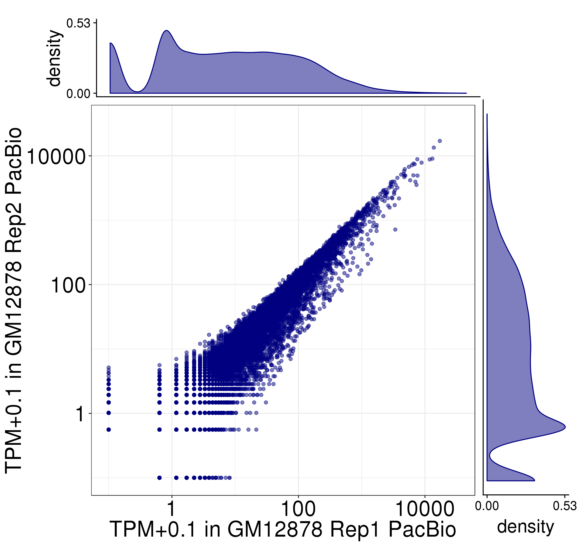
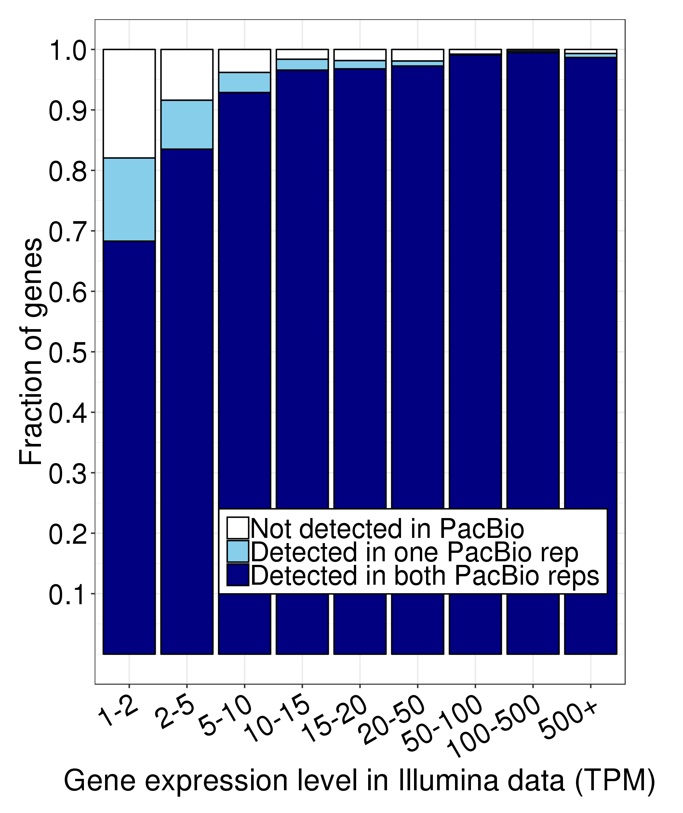
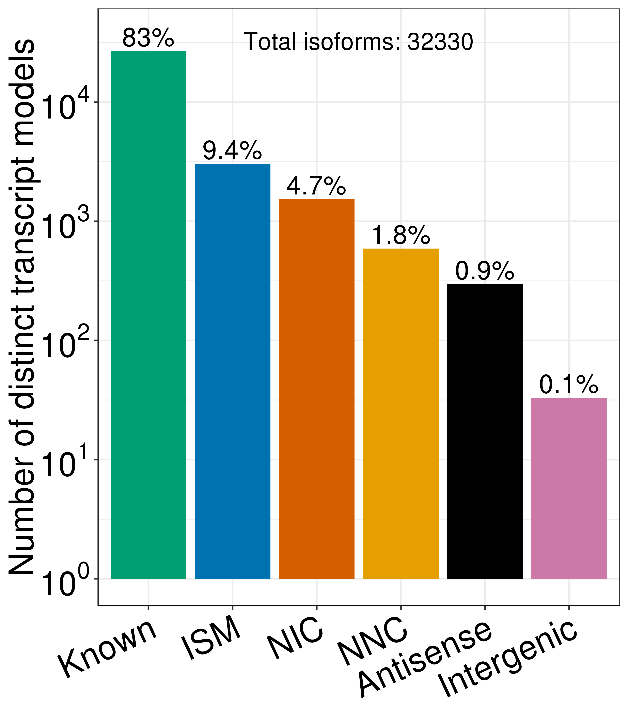
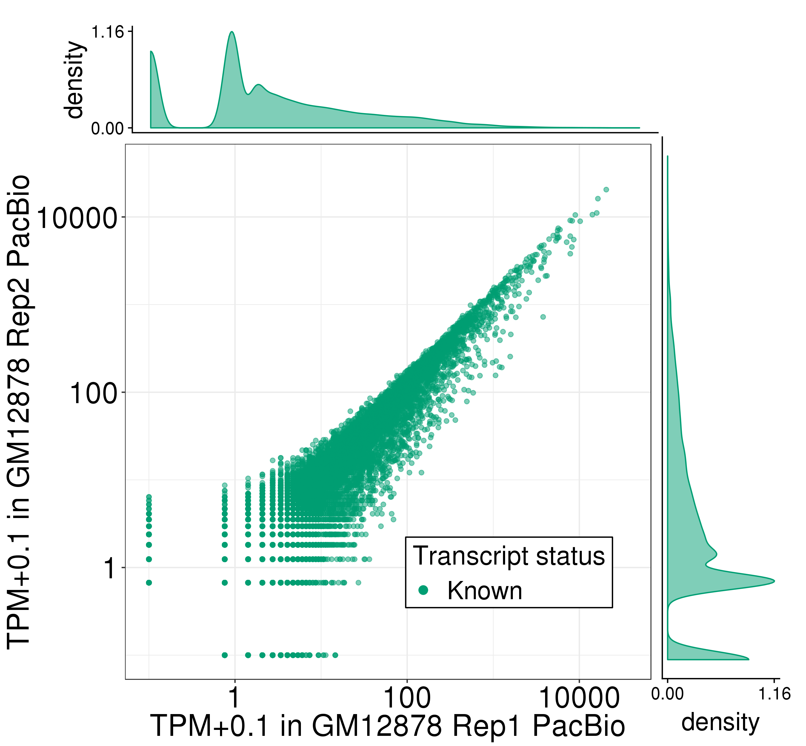
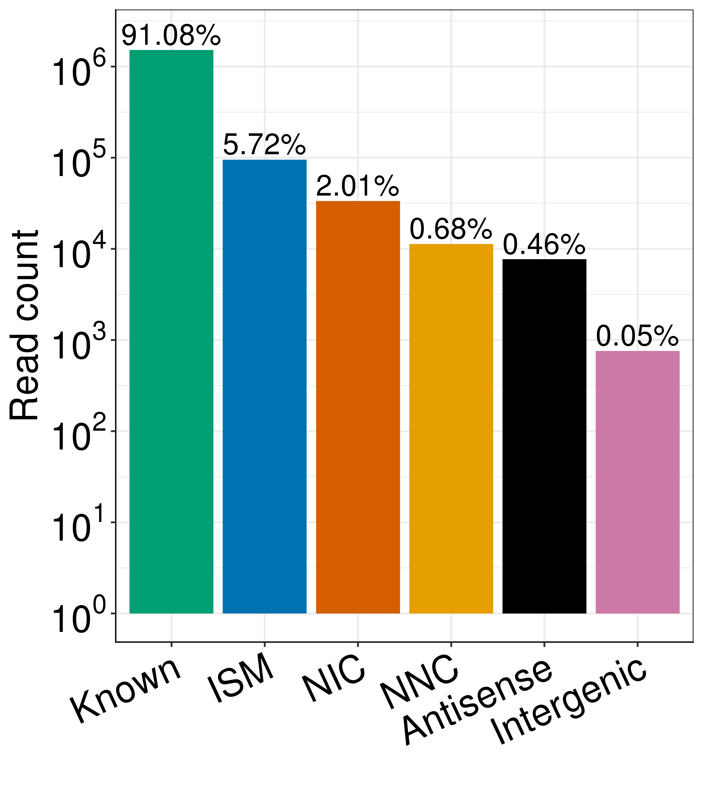

# Figure 2
A step-by-step description of how we generated the panels of Figure 2 in the TALON manuscript

First, some filepaths:
```
PLOTPATH=../plotting_scripts
abundance=/share/crsp/lab/seyedam/share/TALON_paper_data/revisions_1-20/human_TALON/pb_talon_abundance.tsv
filt_abundance=/share/crsp/lab/seyedam/share/TALON_paper_data/revisions_1-20/human_TALON/pb_talon_abundance_filtered.tsv
kallisto1=../Illumina/GM12878/Kallisto/Rep1/abundance.tsv
kallisto2=../Illumina/GM12878/Kallisto/Rep2/abundance.tsv
```
Software versions:
* R v3.5.1  

## Panel A: Expression level of known genes (GENCODE v29) in each biological replicate of GM12878
```
Rscript ${PLOTPATH}/plot_longread_gene_expression_corr.R \
          --f ${abundance} \
          --color blue \
          --d1 PB_GM12878_R1 \
          --d2 PB_GM12878_R2 \
          --celltype GM12878 \
          --d1_type 'Rep1 PacBio' \
          --d2_type 'Rep2 PacBio' \
          -o plots/
```

Pearson and Spearman correlations are recorded in plots/PB_GM12878_R1-PB_GM12878_R2_gene_correlations.txt.

## Panel B: Proportion of genes expressed in Illumina RNA-seq data of GM12878 that are also detected in the PacBio GM12878 data, binned by Illumina expression level
```
Rscript ${PLOTPATH}/plot_detection_by_TPM_for_datasets.R \
         --f ${abundance} \
         --datasets PB_GM12878_R1,PB_GM12878_R2 \
         --ik1 ${kallisto1} \
         --ik2 ${kallisto2} \
         --color blue \
         --dtype PacBio \
         -o plots/
```
	

## Panel C: Comparison of gene expression levels for known genes in the PacBio and Illumina RNA-seq platforms (GM12878)
```
Rscript ${PLOTPATH}/longread_v_illumina_gene_counts_edgeR.R \
         --f ${abundance} \
         --datasets PB_GM12878_R1,PB_GM12878_R2 \
         --ik1 ${kallisto1} \
         --ik2 ${kallisto2} \
         --color blue \
         --ymax 20 \
         -o plots/
```


## Panel D: Number of distinct transcript isoforms observed in each novelty category (GM12878)
```
Rscript ${PLOTPATH}/plot_novelty_categories_distinct_isoforms.R \
         --f ${filt_abundance} \
         --datasets PB_GM12878_R1,PB_GM12878_R2 \
         --o plots/
```


## Panel E: Expression level of known transcript models in each biological replicate of GM12878
```
Rscript ${PLOTPATH}/plot_longread_transcript_expression_corr.R \
         --f ${filt_abundance} \
         --d1 PB_GM12878_R1 \
         --d1_type 'Rep1 PacBio' \
         --d2 PB_GM12878_R2 \
         --d2_type 'Rep2 PacBio' \
         --celltype GM12878 \
         -o plots/
```


## Panel F: Expression of transcript models in each biological replicate of GM12878, labeled by their novelty assignments
```
Rscript ${PLOTPATH}/plot_longread_transcript_expression_corr.R \
         --f ${filt_abundance} \
         --d1 PB_GM12878_R1 \
         --d1_type 'Rep1 PacBio' \
         --d2 PB_GM12878_R2 \
         --d2_type 'Rep2 PacBio' \
         --celltype GM12878 \
         --ISM --NIC --NNC --antisense --intergenic \
         -o plots/
```


## Panel G: Comparison of known transcript expression levels in the PacBio and Illumina RNA-seq platforms (GM12878 Rep 1 and 2).
```
Rscript ${PLOTPATH}/longread_v_illumina_transcripts_edgeR.R \
         --f ${filt_abundance} \
         --datasets PB_GM12878_R1,PB_GM12878_R2 \
         --ik1 ${kallisto1} \
         --ik2 ${kallisto2} \
         --color green \
         --ymax 20 \
          -o plots/
```

## Panel H: Total number of PacBio reads assigned to each novelty category after transcript filtering
```
Rscript ${PLOTPATH}/plot_novelty_category_read_counts_one_dataset.R \
         --f ${filt_abundance}  \
         --dataset PB_GM12878_R1 \
         --o plots/
```

