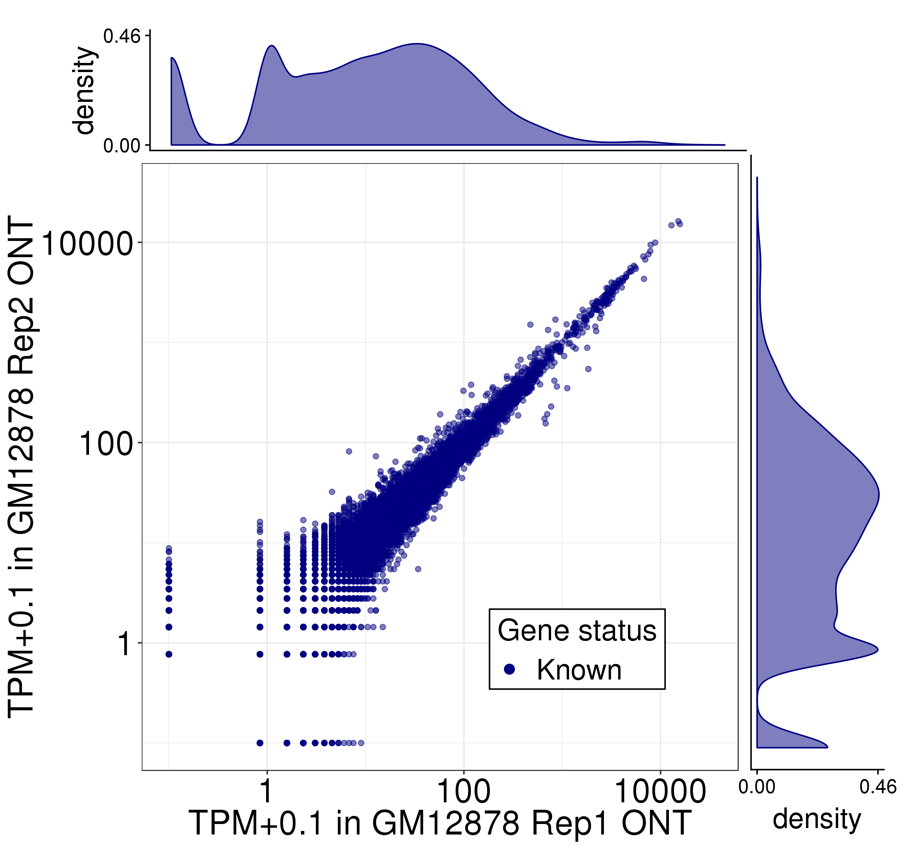
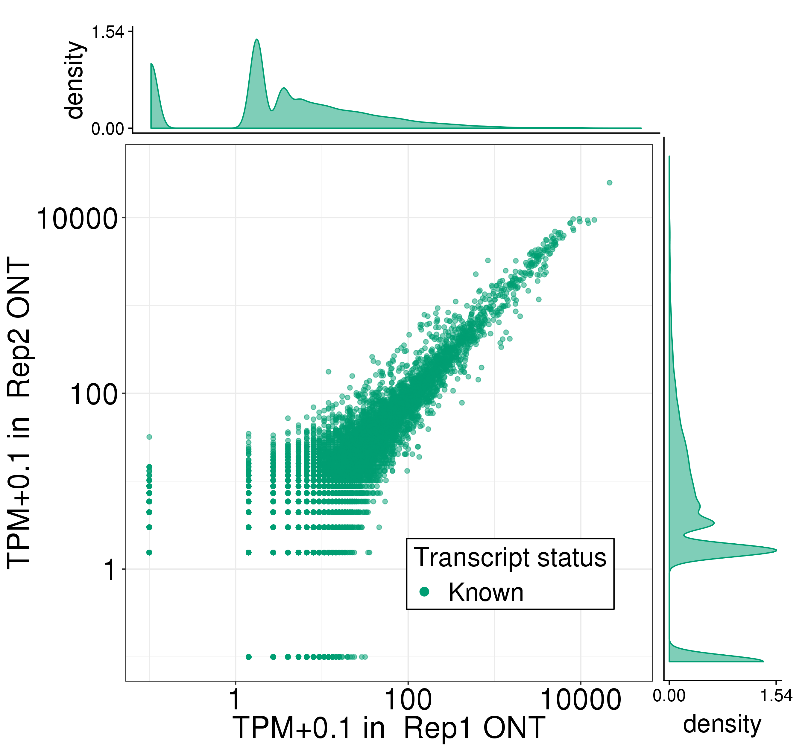
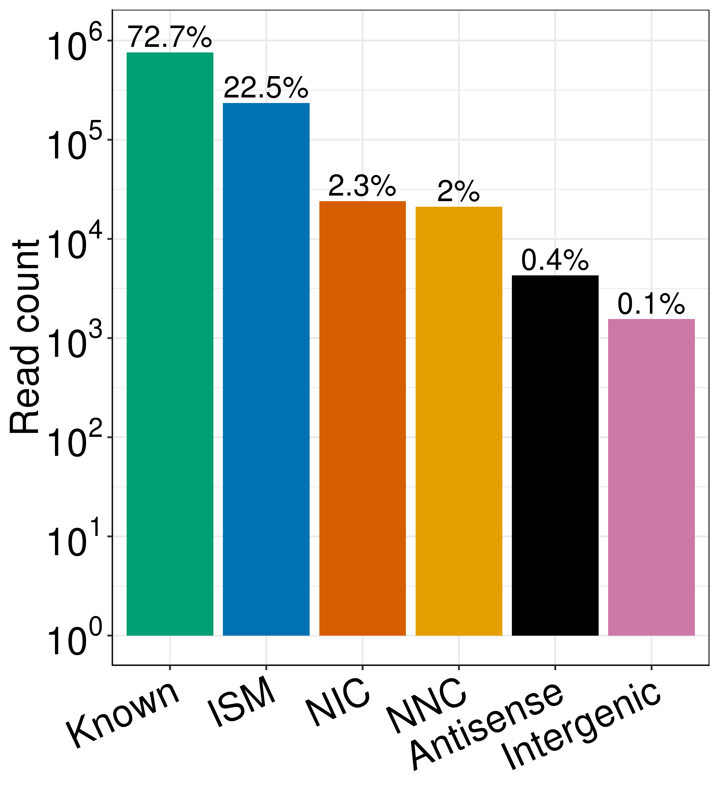
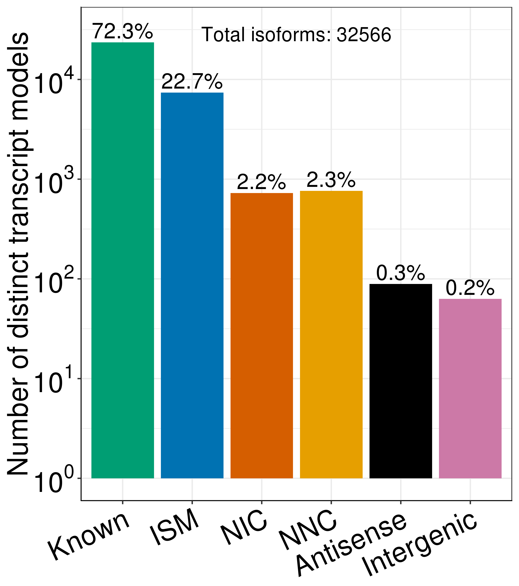
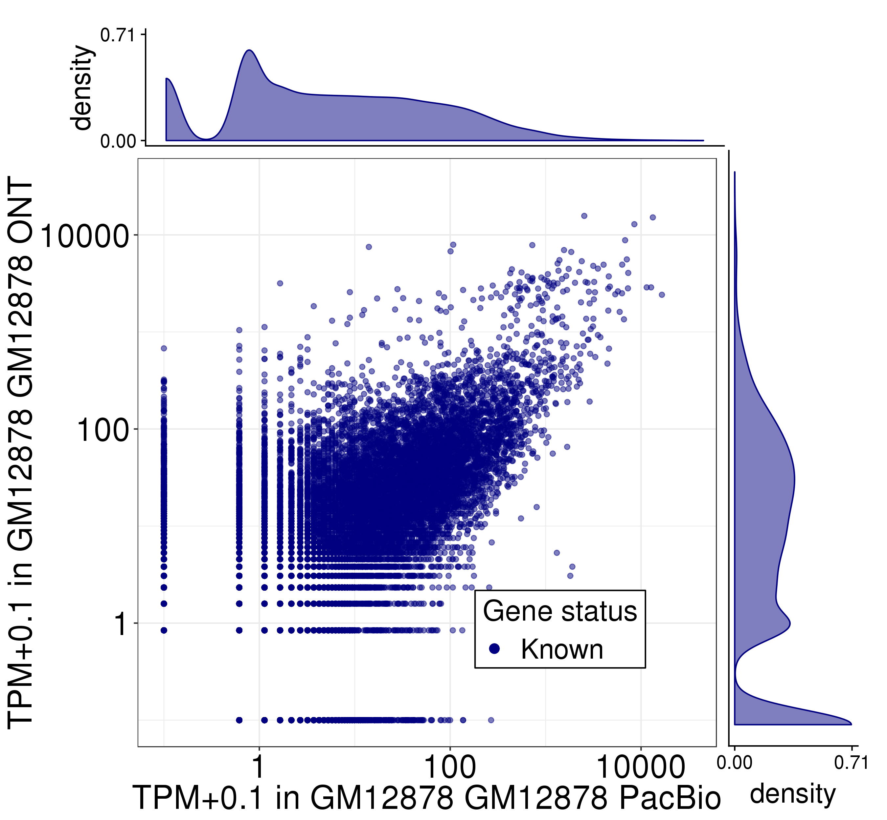
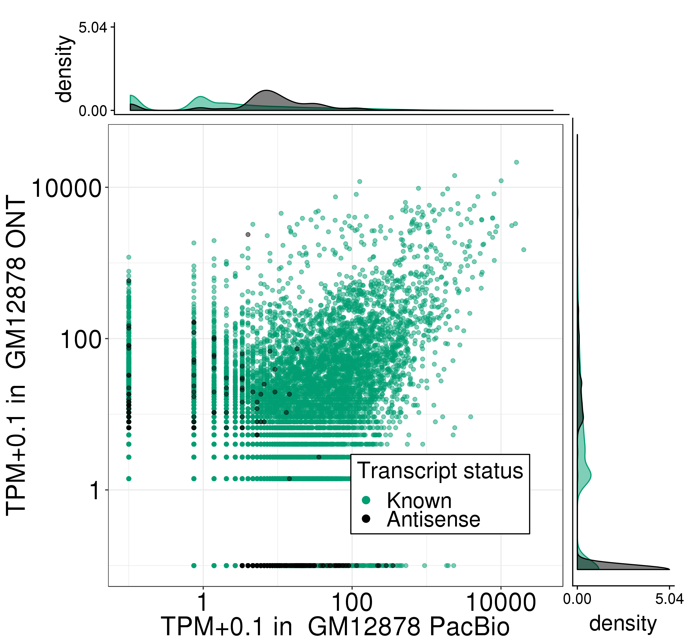

# Figure 3: Comparison of Oxford Nanopore direct RNA-seq transcriptome with Pacbio transcriptome in GM12878.


Firstly, some filepaths:
```bash
PLOTPATH=../plotting_scripts
APATH=../analysis_scripts

abundance=/share/crsp/lab/seyedam/share/TALON_paper_data/revisions_1-20/human_TALON/ont_talon_abundance.tsv
filt_abundance=/share/crsp/lab/seyedam/share/TALON_paper_data/revisions_1-20/human_TALON/ont_talon_abundance_filtered.tsv
gtf=/share/crsp/lab/seyedam/share/TALON_paper_data/revisions_1-20/human_TALON/ont_talon_observedOnly.gtf
pb_ont_abundance=/share/crsp/lab/seyedam/share/TALON_paper_data/revisions_1-20/human_TALON/pb_ont_talon_abundance.tsv
pb_ont_filt_abundance=/share/crsp/lab/seyedam/share/TALON_paper_data/revisions_1-20/human_TALON/pb_ont_talon_abundance_filtered.tsv
mkdir plots
```
Software versions:
* R v3.5.1  

## Panel A: Expression level of known genes (GENCODE v29) in each biological replicate of GM12878
```bash
Rscript ${PLOTPATH}/plot_longread_gene_expression_corr.R \
          --f ${abundance} \
          --color blue \
          --d1 ONT_GM12878_R1 \
          --d2 ONT_GM12878_R2 \
          --celltype GM12878 \
          --d1_type 'Rep1 ONT' \
          --d2_type 'Rep2 ONT' \
          -o plots/
```


Correlations are in ONT_GM12878_R1-ONT_GM12878_R2_gene_correlations.txt. 


## Panel B: Expression level of known transcript models in each biological replicate of GM12878 in Oxford Nanopore
```bash
Rscript ${PLOTPATH}/plot_longread_transcript_expression_corr.R  \
          --f ${filt_abundance} \
          --d1 ONT_GM12878_R1 \
          --d2 ONT_GM12878_R2 \
          --d1_type 'Rep1 ONT' \
          --d2_type 'Rep2 ONT' \
          -o plots/ 
```


Correlations are in ONT_GM12878_R1-ONT_GM12878_R2_Known_transcript_correlations.txt. 

## Panel C: Total number of Oxford Nanopore reads assigned to each novelty category after transcript filtering
```bash
Rscript ${PLOTPATH}/plot_novelty_category_read_counts_one_dataset.R \
         --f ${filt_abundance}  \
         --dataset ONT_GM12878_R1 \
         --o plots/
```



## Panel D: Number of distinct transcript isoforms observed in each novelty category (Oxford Nanopore GM12878)
```bash
Rscript ${PLOTPATH}/plot_novelty_categories_distinct_isoforms.R \
         --f ${filt_abundance} \
         --datasets ONT_GM12878_R1,ONT_GM12878_R2 \
         --o plots/
```




## Panel E: Expression level of known genes (Gencode v29) models in GM12878 as quantified using PacBio (x) and Oxford Nanopore (y)
```bash
Rscript ${PLOTPATH}/plot_longread_gene_expression_corr.R \
          --f ${pb_ont_abundance} \
          --color blue \
          --d1 PB_GM12878_R1 \
          --d2 ONT_GM12878_R1 \
          --celltype GM12878 \
          --d1_type 'GM12878 PacBio' \
          --d2_type 'GM12878 ONT' \
          -o plots/
```


Correlations are in PB_GM12878_R1-ONT_GM12878_R1_Known_transcript_correlations.txt. 


## Panel F: Expression level of known and antisense transcript (Gencode v29) models in GM12878 as quantified using PacBio (x) and Oxford Nanopore (y)
```bash
Rscript ${PLOTPATH}/plot_longread_transcript_expression_corr.R  \
          --f ${pb_ont_filt_abundance} \
          --d1 PB_GM12878_R1 \
          --d2 ONT_GM12878_R1 \
          --d1_type 'GM12878 PacBio' \
          --d2_type 'GM12878 ONT' \
          -o plots/ \
          --antisense 
```


Correlations are in PB_GM12878_R1-ONT_GM12878_R1_Known-Antisense_transcript_correlations.txt.

## Panel G: Visualization of ONT GM12878 custom GTF annotations in the UCSC genome browser
```bash
# create config file for gtf creation
# replace url with the url to your public-facing directory
url=http://crick.bio.uci.edu/freese/TALON_gtf/ont_talon_observedOnly_tracks
printf "${gtf},n+,0,none,$url" > pb_ont_track_config
python ${APATH}/gen_novelty_tracks_gtf.py \
    --c pb_ont_track_config
```

<!-- ```R
Rscript ${PLOTPATH}/plot_longread_gene_expression_corr.R \
          --f ${pb_ont_abundance} \
          --color blue \
          --d1 PB_GM12878_R2 \
          --d2 ONT_GM12878_R1 \
          --celltype GM12878 \
          --d1_type 'Rep2 PB' \
          --d2_type 'Rep1 ONT' \
          -o plots/
``` -->

<!-- ```R
Rscript ${PLOTPATH}/plot_longread_gene_expression_corr.R \
          --f ${pb_ont_abundance} \
          --color blue \
          --d1 PB_GM12878_R1 \
          --d2 ONT_GM12878_R2 \
          --celltype GM12878 \
          --d1_type 'Rep1 PB' \
          --d2_type 'Rep2 ONT' \
          -o plots/
```

```R
Rscript ${PLOTPATH}/plot_longread_gene_expression_corr.R \
          --f ${pb_ont_abundance} \
          --color blue \
          --d1 PB_GM12878_R2 \
          --d2 ONT_GM12878_R2 \
          --celltype GM12878 \
          --d1_type 'Rep2 PB' \
          --d2_type 'Rep2 ONT' \
          -o plots/
``` -->


<!-- ```R
Rscript ${PLOTPATH}/plot_longread_transcript_expression_corr.R  \
          --f ${pb_ont_filt_abundance} \
          --d1 PB_GM12878_R2 \
          --d2 ONT_GM12878_R1 \
          --d1_type 'Rep2 PB' \
          --d2_type 'Rep1 ONT' \
          -o plots/ 
```

```R
Rscript ${PLOTPATH}/plot_longread_transcript_expression_corr.R  \
          --f ${pb_ont_filt_abundance} \
          --d1 PB_GM12878_R1 \
          --d2 ONT_GM12878_R2 \
          --d1_type 'Rep1 PB' \
          --d2_type 'Rep2 ONT' \
          -o plots/ 
```

```R
Rscript ${PLOTPATH}/plot_longread_transcript_expression_corr.R  \
          --f ${pb_ont_filt_abundance} \
          --d1 PB_GM12878_R2 \
          --d2 ONT_GM12878_R2 \
          --d1_type 'Rep2 PB' \
          --d2_type 'Rep2 ONT' \
          -o plots/ 
``` -->

