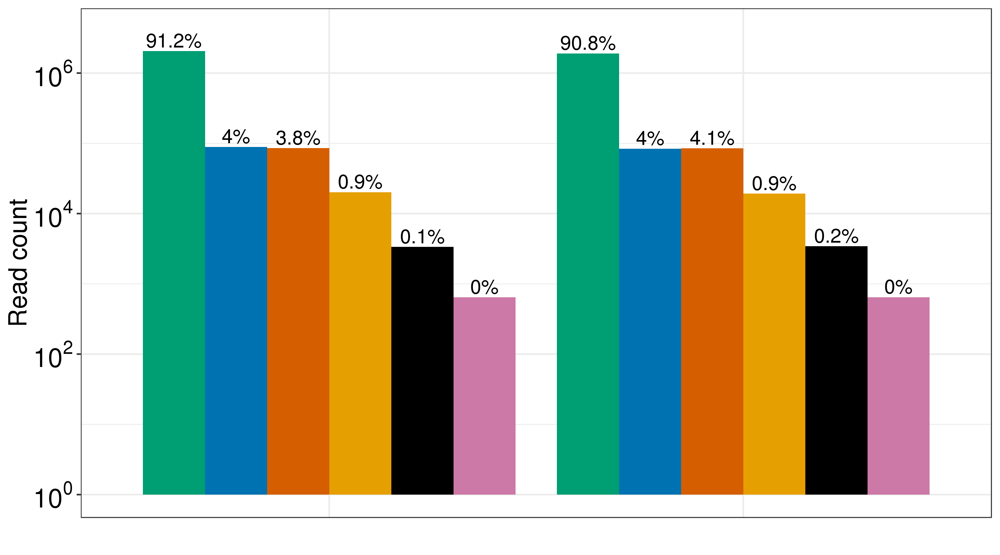
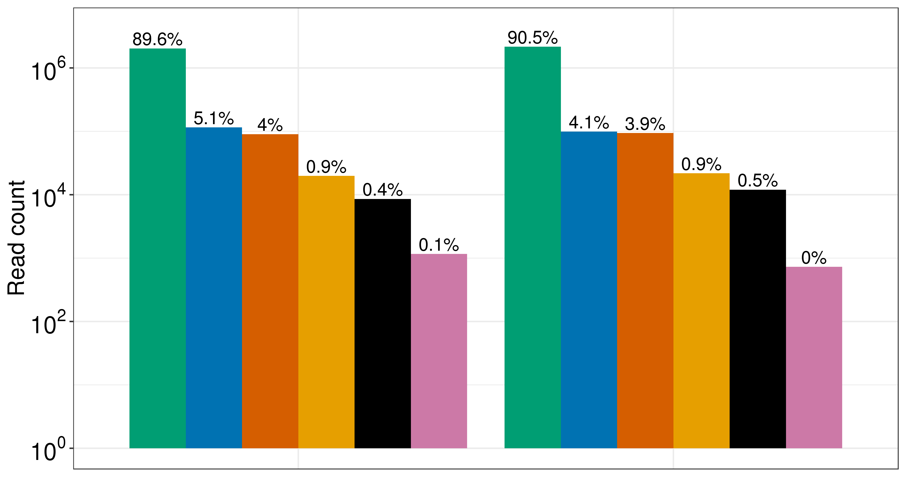
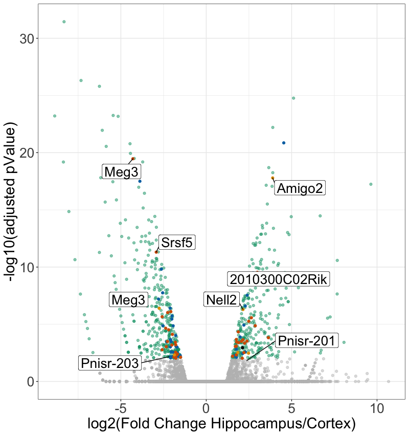
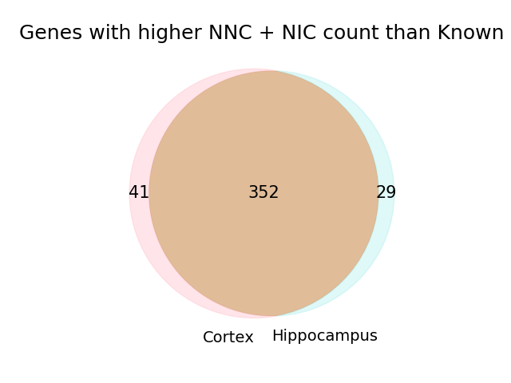

# Figure 5
A step-by-step description of how we generated the panels of Figure 5 in the TALON manuscript

First, some filepaths:
```
PLOTPATH=../plotting_scripts
abundance=/share/crsp/lab/seyedam/share/TALON_paper_data/revisions_1-20/mouse_TALON/Brain_talon_abundance.tsv
filt_abundance=/share/crsp/lab/seyedam/share/TALON_paper_data/revisions_1-20/mouse_TALON/Brain_talon_abundance_filtered.tsv
gtf=/share/crsp/lab/seyedam/share/TALON_paper_data/revisions_1-20/mouse_TALON/Brain_talon.gtf
```
Software versions:
* R v3.6.0
* edgeR v3.28.1 

## Panel A: Total number of PacBio reads assigned to each novelty category after transcript filtering in Cortex
```bash
Rscript ${PLOTPATH}/plot_novelty_category_read_counts.R \
         --f ${filt_abundance}  \
         --dataset PacBio_Cortex_Rep1,PacBio_Cortex_Rep2 \
         --o plots/
```


## Panel B: Total number of PacBio reads assigned to each novelty category after transcript filtering in Hippocampus
```bash
Rscript ${PLOTPATH}/plot_novelty_category_read_counts.R \
         --f ${filt_abundance}  \
         --dataset PacBio_Hippocampus_Rep1,PacBio_Hippocampus_Rep2 \
         --o plots/
```
	

## Panel C: Differential Transcript Expression
Check the Rscript 



## Panel D: 
```bash
cp S30.py and TALONClass to the directory where ${filt_abundance} is then run:

python S30.py
 
```


## Panel E: Psnir UCSC Genome Browser screenshot and expression
Run the following script, but replace the url for one that you know is publically accessible and can be used to host the GTF tracks on the genome browser. 

```bash
python ../analysis_scripts/gen_novelty_tracks_gtf.py \
	-gtf $gtf \
	-novelty n+ \
	-combine_isms 0 \
	-url http://http://crick.bio.uci.edu/freese/TALON_gtf/ 
```


To plot the expression of each isoform see the Rscript Barplot_pnisr.R


