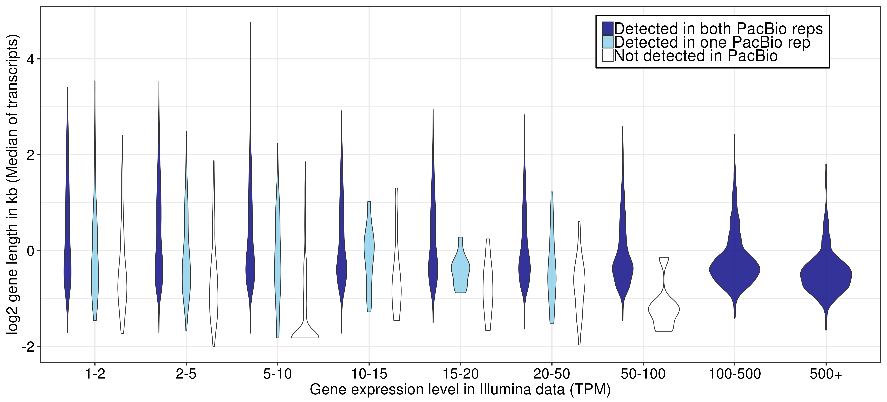
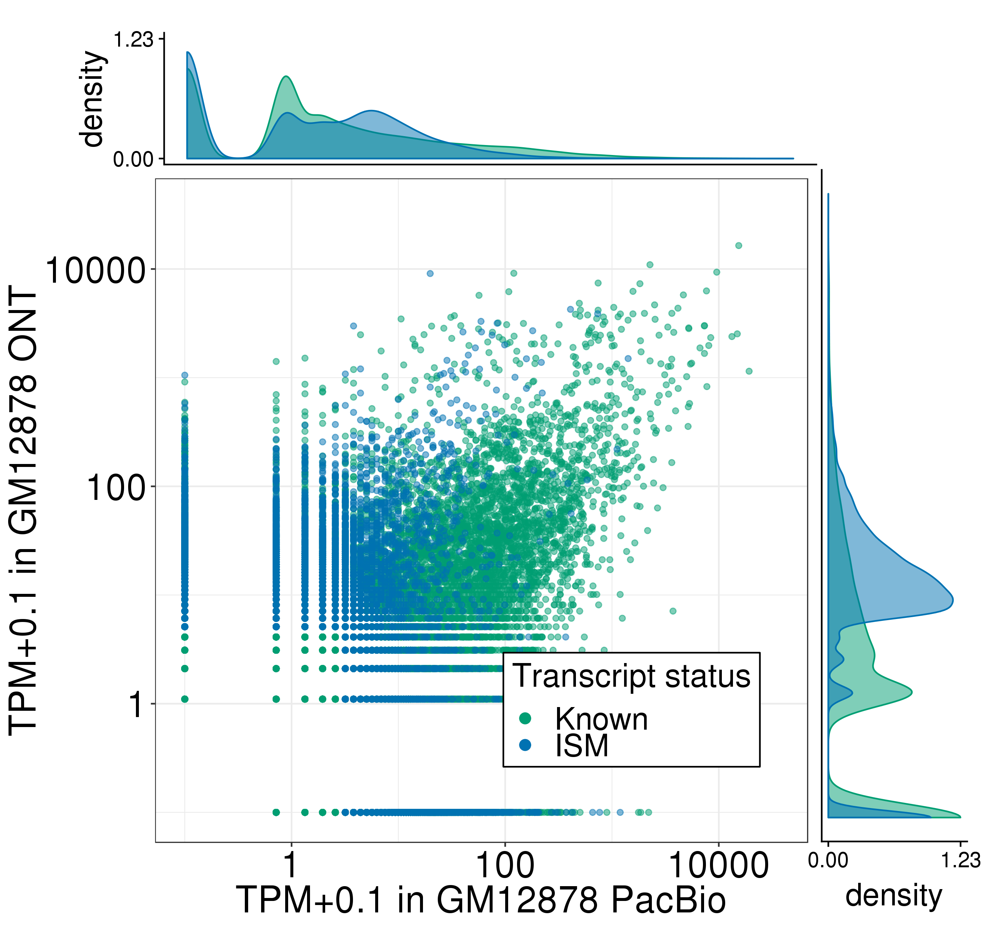

# Supplement

Files/paths:
```bash
PLOTPATH=../plotting_scripts
DATA=/share/crsp/lab/seyedam/share/TALON_paper_data/revisions_1-20/human_TALON

db=/share/crsp/lab/seyedam/share/TALON_paper_data/revisions_1-20/human_TALON/full_gencode_v29_SIRV_2020-02-29.db

abundance=/share/crsp/lab/seyedam/share/TALON_paper_data/revisions_1-20/human_TALON/ont_talon_abundance.tsv
filt_abundance=/share/crsp/lab/seyedam/share/TALON_paper_data/revisions_1-20/human_TALON/ont_talon_abundance_filtered.tsv

kallisto1=../Illumina/GM12878/Kallisto/Rep1/abundance.tsv
kallisto2=../Illumina/GM12878/Kallisto/Rep2/abundance.tsv
```

## Figure S? and Figure S?: TALON read length distributions for PacBio and ONT GM12878 datasets

Remove SIRV and ERCC reads
```bash
awk '{if($4 !~ "ERCC" && $4 !~ "SIRV") print $0}' \
    $DATA/GM12878_talon_read_annot.tsv > read_lengths/GM12878_main_read_annot.tsv
```
Plot
```bash
python ${PLOTPATH}/plot_read_length_distributions.py \
    --r read_lengths/GM12878_main_read_annot.tsv \
     --datasets PB_GM12878_R1,PB_GM12878_R2,ONT_GM12878_R1,ONT_GM12878_R2 \
     --map read_lengths/read_length_name_mapping.csv \
     --o read_lengths/
```
See resulting plots [here](https://github.com/dewyman/TALON-paper-2020/tree/master/Supplement/read_lengths).


## Figure S? Further characterization of gene detection in GM12878 by short reads and PacBio long reads.

## Panel A: Length of known genes binned by short-read expression level in GM12878 and colored by PacBio detection status. Gene length was computed by taking the median length of all known transcripts per gene.
```bash
Rscript ${PLOTPATH}/plot_gene_length_by_detection_for_datasets.R \
           --db $db \
           --datasets PB_GM12878_R1,PB_GM12878_R2 \
           --ik1 ${kallisto1} \
           --ik2 ${kallisto2} \
           --color blue \
           -o figures/
```


# Figure S?: Number of exons per transcript model detected in PacBio GM12878 transcriptomes. Transcripts are grouped by novelty type assignment.
```bash
Rscript ${PLOTPATH}/plot_n_exons_by_novelty.R \
    --f ${filt_abundance} \
    -o figures/
```


# Figure S?: Transcript and gene quantification by PacBio/ONT and TALON 
```bash
abundance=${DATA}/pb_ont_talon_abundance.tsv
filt_abundance=${DATA}/pb_ont_talon_abundance_filtered.tsv
```

## Panel A: Expression level of known and ISM transcript models in PacBio/ONT in GM12878
```bash
Rscript ${PLOTPATH}/plot_longread_transcript_expression_corr.R \
         --f ${filt_abundance} \
         --d1 PB_GM12878_R1 \
         --d1_type 'PacBio' \
         --d2 ONT_GM12878_R1 \
         --d2_type 'ONT' \
         --celltype GM12878 \
         --ISM \
         -o figures/
```

Correlations are in PB_GM12878_R1-ONT_GM12878_R1_Known-ISM_transcript_correlations.txt. 

<!-- 
## Panel B: Detection of known genes as a function of PacBio read depth in GM12878. The number of short-read genes that were detected in PacBio is shown cumulatively for each possible ordering of four PacBio datasets. The total number of Illumina genes was 10367.
```bash
Rscript ${PLOTPATH}/plot_discovery_curve_knownOnly.R \
    --f /share/crsp/lab/seyedam/share/TALON_paper_data/revisions_10-19/human_TALON/analysis/supplementary_tables/XS1_PacBio_GM12878_all4_talon_abundance.tsv \
    --color blue \
    --rc PacBio_GM12878_read_counts.csv \
    --ik1 ${kallisto1} \
    --ik2 ${kallisto2} \
    -o figures/

```
This script call also creates the file: figures/gene_detection.csv, which is needed for Panel C.


## Panel C: GC content of known genes that were detected in at least one of four PacBio replicates, versus those that were detected in short reads only.
```bash
python ../GC-content/run_GC_analysis.py \
    --genes figures/gene_detection.csv \
    --fasta ../refs/gencode.v29.transcripts.fa.gz \
    --o figures
```
 -->


