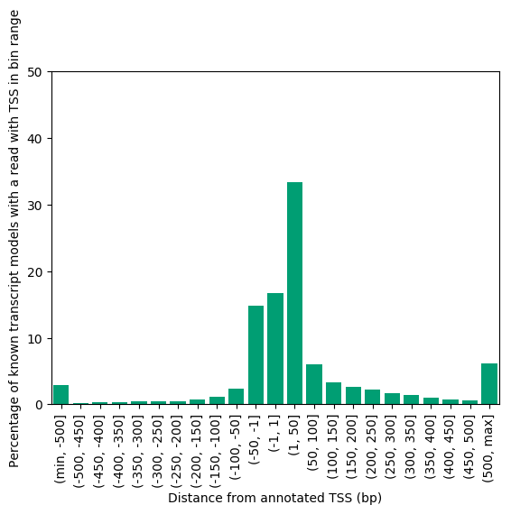
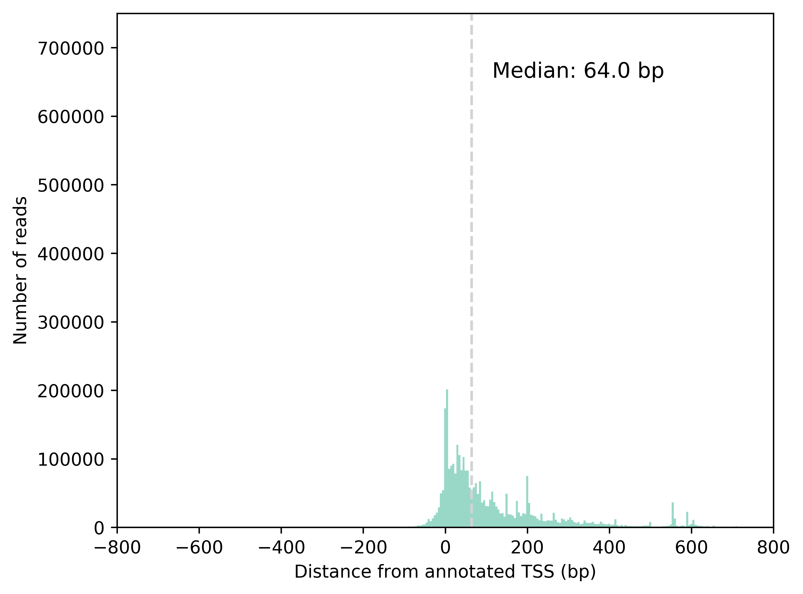
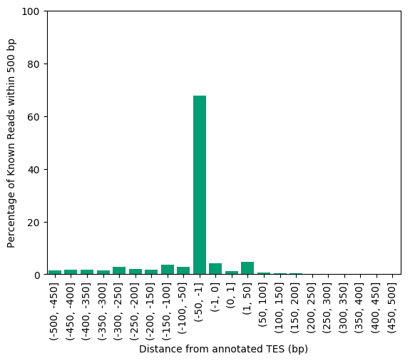
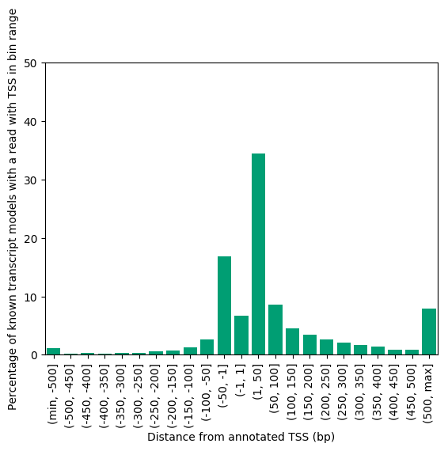
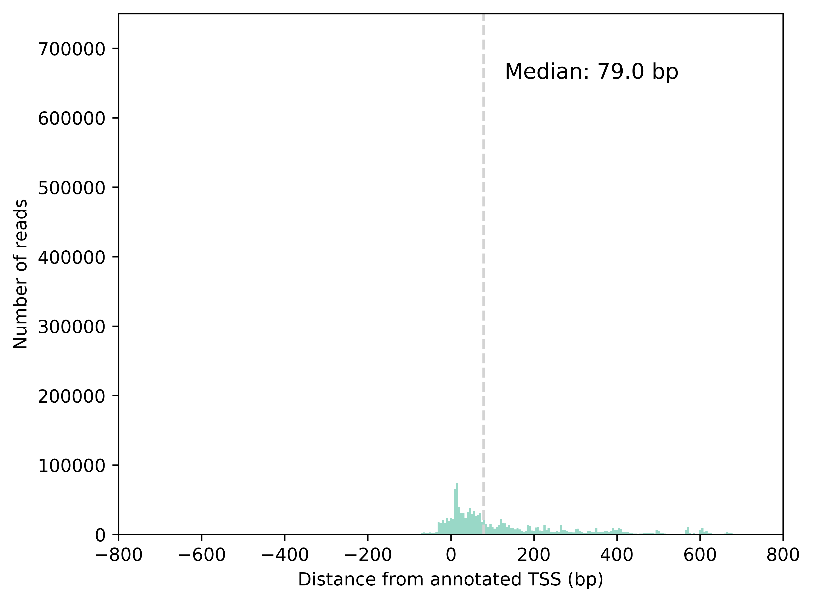
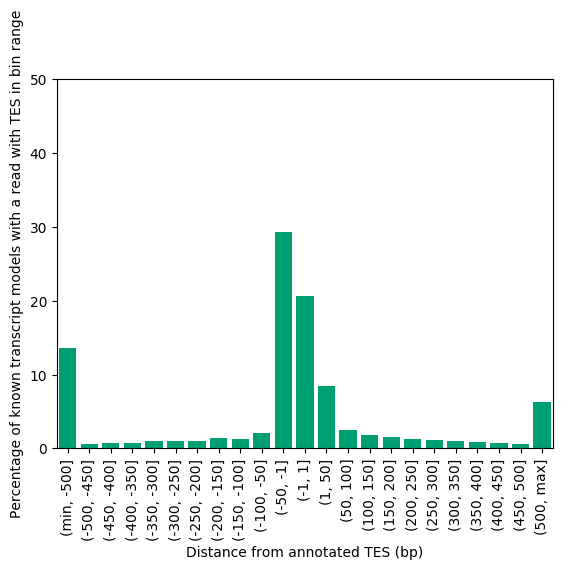
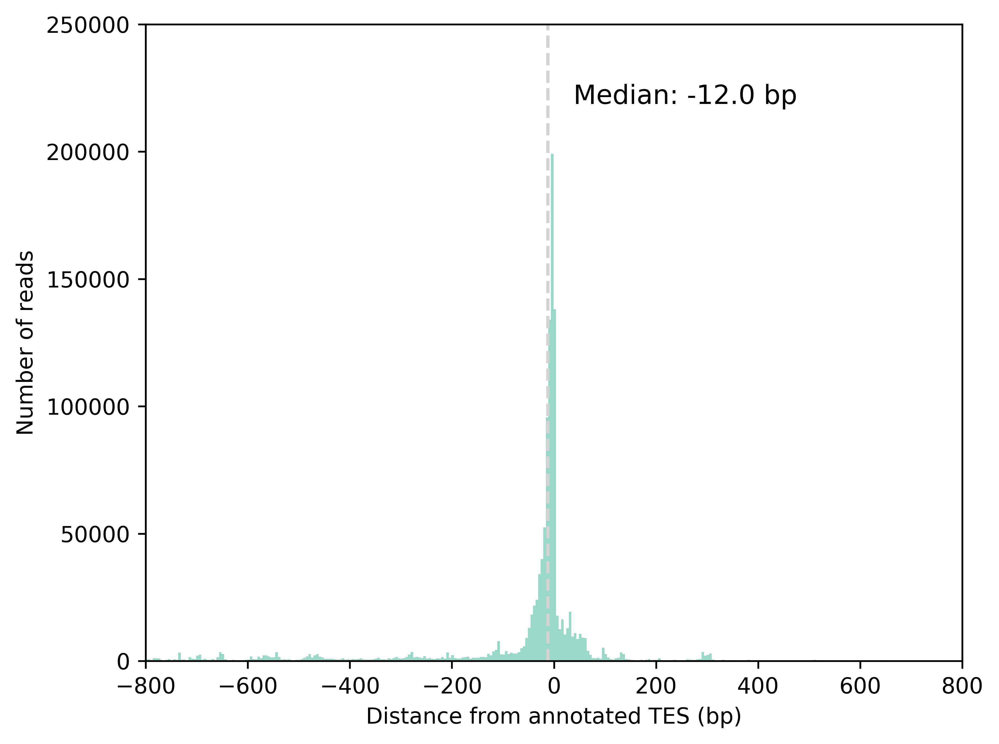

# Plot distance from the start and end sites assoc with the intron chain of each known transcript

1. Create a file listing the TSS and TES position for each annotated transcript:
```bash
python get_annotated_TSSs_and_TESs.py \
    --gtf ../refs/GENCODE_v29/gencode.v29.SIRV.ERCC.annotation.gtf \
    --o gencode.v29.SIRV.ERCC.TSS_and_TES.tsv
```

2. Plot distance of actual read start/end from the annotated start/end associated with the annotated intron chain
```bash
python plot_TSS_and_TES_annot_dists.py \
    --f /share/crsp/lab/seyedam/share/TALON_paper_data/revisions_1-20/human_TALON/GM12878_talon_read_annot.tsv \
    --ref gencode.v29.SIRV.ERCC.TSS_and_TES.tsv \
    --datasets PB_GM12878_R1,PB_GM12878_R2 \
    --xmax 800 \
    --ymax 750000 \
    --o GM12878_PacBio
```






We also get results about the number of known isoforms that have a read with a start that falls within 50 bp of the annotated TSS/TES

```
Found 17404 models with at least one read within 50 bp of the annotated TSS, which is 64.88% of known models
Found 13876 models with at least one read within 50 bp of the annotated TES, which is 51.73% of known models
Found 9457 models with at least one read within 50 bp of the annotated TSS and with at least one read within 50 bp of the annotated TES, which is 35.26% of known models
```

# Plot distance of each read start (known transcripts only in PacBio) from closest CAGE peak
1. Make a bed file of start sites
```bash
python make_read_start_bed_file.py \
    --f /share/crsp/lab/seyedam/share/TALON_paper_data/revisions_1-20/human_TALON/GM12878_talon_read_annot.tsv \
    --datasets PB_GM12878_R1,PB_GM12878_R2 \
    --o GM12878_PacBio
```

2. Run bedtools closest utility on start site file and CAGE peak file
```bash
bedtools closest -a <(bedtools sort -i GM12878_PacBio_known_read_starts.bed) \
                 -b <(bedtools sort -i ../CAGE_data/FANTOM5/hg38_CAGE.bed) \
                 -t first \
                 -s -D a -nonamecheck > GM12878_PacBio_bedtools_closest.tsv
```

3. Plot histogram
```bash
python plot_closest_CAGE.py \
    --f GM12878_PacBio_bedtools_closest.tsv \
    --xmax 800 --ymax 3500000 --o GM12878_PacBio    
```

4. Also generate plots for ONT 
```bash
python plot_TSS_and_TES_annot_dists.py \
    --f /share/crsp/lab/seyedam/share/TALON_paper_data/revisions_1-20/human_TALON/GM12878_talon_read_annot.tsv \
    --ref gencode.v29.SIRV.ERCC.TSS_and_TES.tsv \
    --datasets ONT_GM12878_R1,ONT_GM12878_R2 \
    --xmax 800 \
    --ymax 750000 \
    --o GM12878_ONT
```






We also get results about the number of known isoforms that have a read with a start that falls within 50 bp of the annotated TSS/TES

```
Found 13680 models with at least one read within 50 bp of the annotated TSS, which is 58.19% of known models
Found 13742 models with at least one read within 50 bp of the annotated TES, which is 58.45% of known models
Found 8299 models with at least one read within 50 bp of the annotated TSS and with at least one read within 50 bp of the annotated TES, which is 35.30% of known models
```
