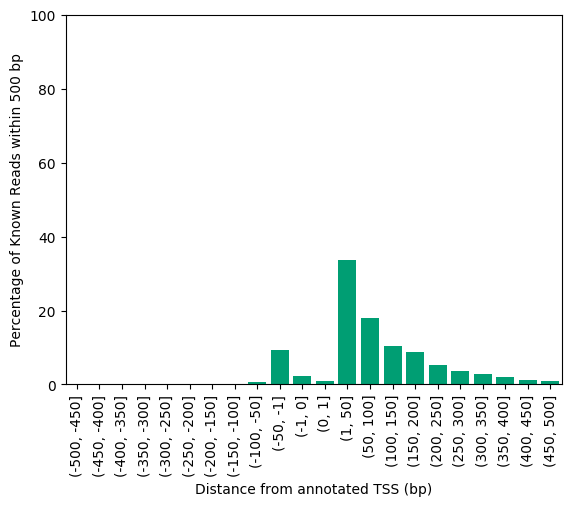
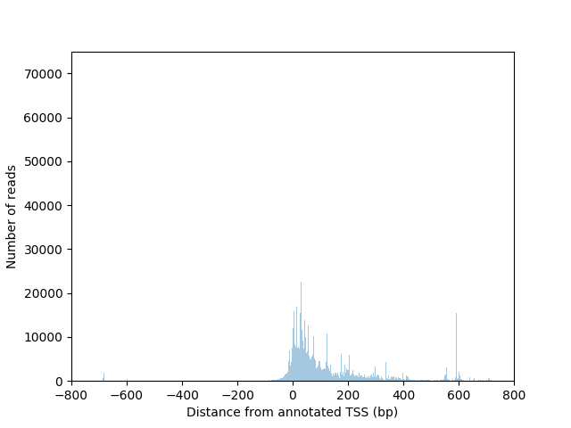
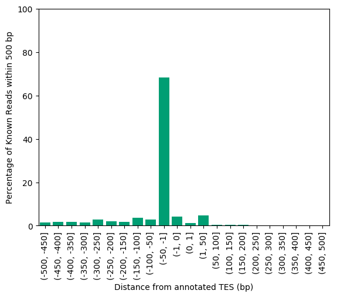
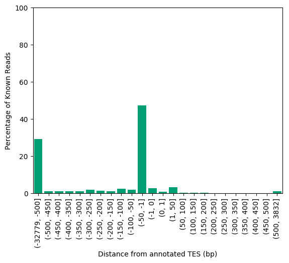
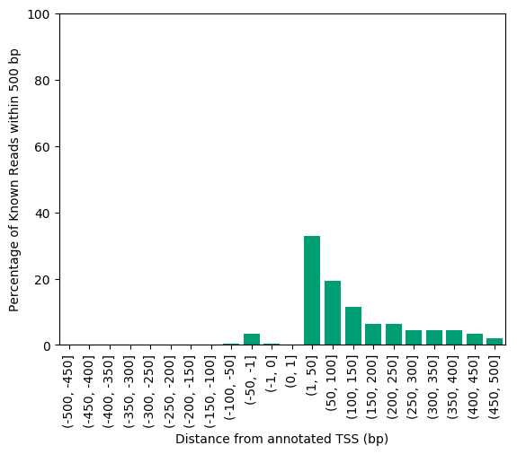
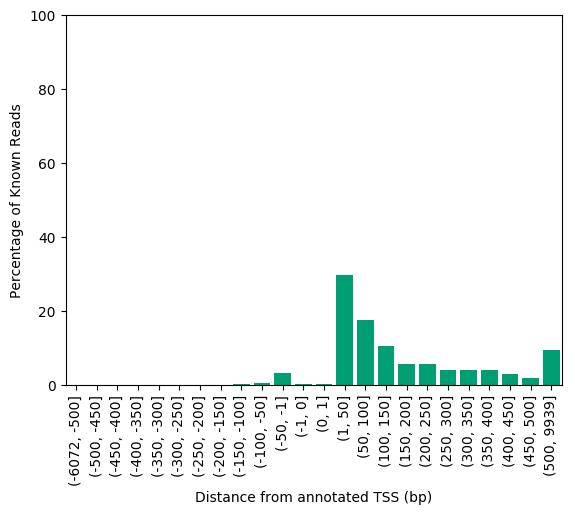
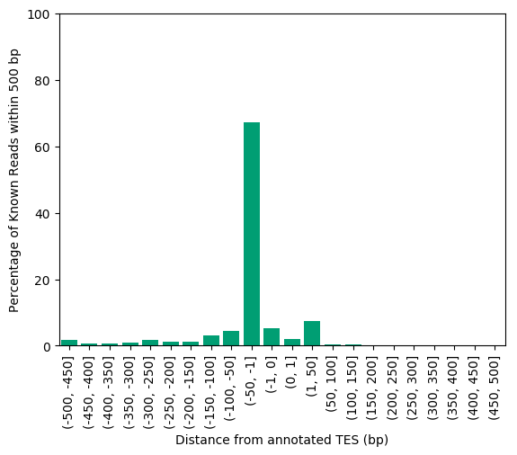
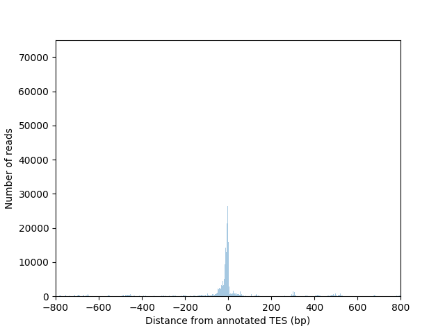

# TSS and TES analysis

For this analysis, we plotted a histogram of the distance from each reads' recorded start and end to its annotated start and end, for known transcripts. We attain the read starts and ends from the read_annot file (which is output from TALON), the annotated start and end from the annotation GTF (which is okay because we're only examining known transcripts that will be present in the annotation).

Get the annotated starts/ends
```bash
gtf=/data/users/freese/mortazavi_lab/ref/gencode.v29/gencode.v29.annotation.gtf
python get_annotated_TSSs_and_TESs.py \
	--gtf $gtf \
	--o gencode.v29.SIRV.ERCC.TSS_and_TES.tsv
```
For the PacBio data: 
```bash
read_annot=/data/users/freese/talon_data/revisions_1-20/human_TALON/GM12878_talon_read_annot.tsv
annot_ends=gencode.v29.SIRV.ERCC.TSS_and_TES.tsv
python plot_end_dists.py \
	-f  $read_annot \
	-a  $annot_ends \
	--datasets 'PB_GM12878_R1,PB_GM12878_R2' \
	-xlim 800 \
	-ylim 90000 \
	-o 'pb'
```






For the ONT data: 
```bash
read_annot=/data/users/freese/talon_data/revisions_1-20/human_TALON/GM12878_talon_read_annot.tsv
annot_ends=gencode.v29.SIRV.ERCC.TSS_and_TES.tsv
python plot_end_dists.py \
	-f  $read_annot \
	-a $annot_ends \
	--datasets 'ONT_GM12878_R1,ONT_GM12878_R2' \
	-xlim 800 \
	-ylim 50000 \
	-o 'ont'
```






