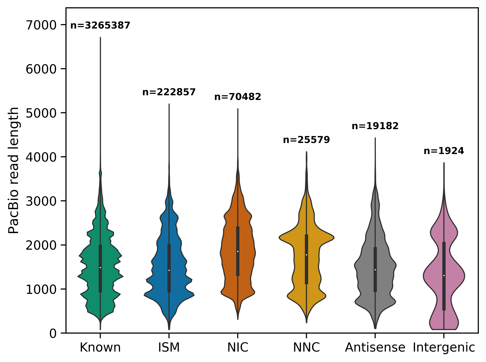
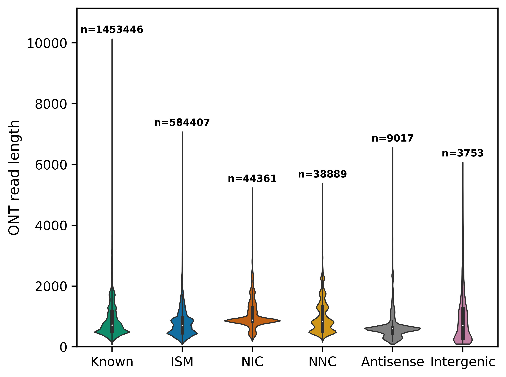

# Length analyses

## Plot length of PacBio reads by novelty assignment (after TALON filtering)
```
read_annot=/share/crsp/lab/seyedam/share/TALON_paper_data/revisions_1-20/human_TALON/GM12878_talon_read_annot.tsv
pb_whitelist=/share/crsp/lab/seyedam/share/TALON_paper_data/revisions_1-20/human_TALON/pb_whitelist.csv
PLOTPATH=../plotting_scripts

python $PLOTPATH/plot_read_length_by_novelty.py \
    --f $read_annot \
    --datasets PB_GM12878_R1,PB_GM12878_R2 \
    --whitelist $pb_whitelist \
    --platform PacBio \
    --o plots/
```


## Plot length of ONT reads by novelty assignment (after TALON filtering)
```
read_annot=/share/crsp/lab/seyedam/share/TALON_paper_data/revisions_1-20/human_TALON/GM12878_talon_read_annot.tsv
ont_whitelist=/share/crsp/lab/seyedam/share/TALON_paper_data/revisions_1-20/human_TALON/ont_whitelist.csv
PLOTPATH=../plotting_scripts

python $PLOTPATH/plot_read_length_by_novelty.py \
    --f $read_annot \
    --datasets ONT_GM12878_R1,ONT_GM12878_R2 \
    --whitelist $ont_whitelist \
    --platform ONT \
    --o plots/
```

