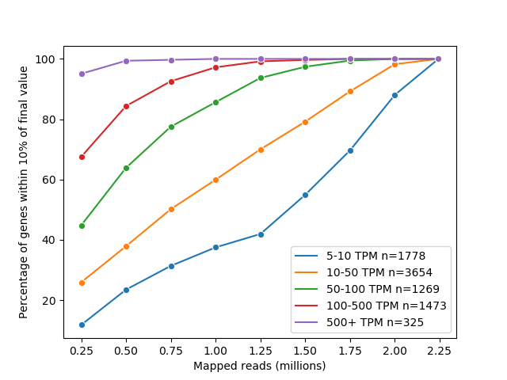
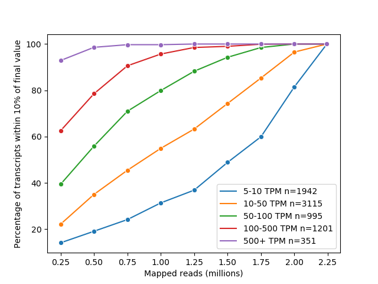
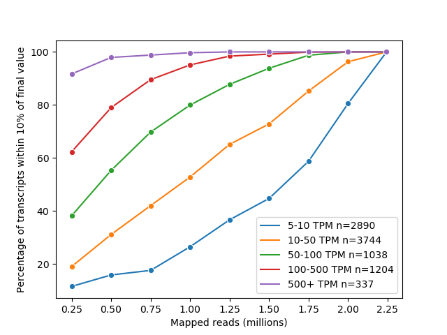
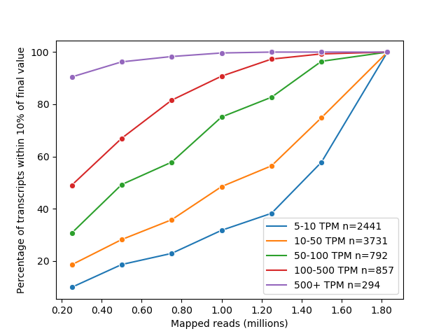
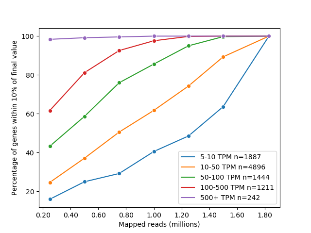
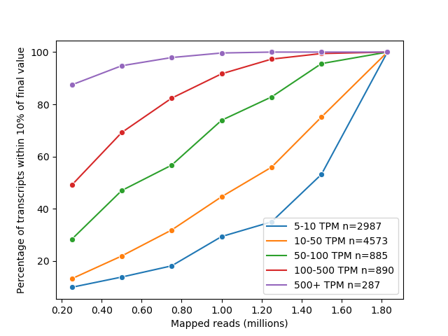

We want to investigate what PacBio sequencing depth is necessary to reach plateuing expression levels. We subsample the reads and evaluate what proportion of genes or transcript expression levels are quantified within 5% of the expression levels we recorded with all of our reads.

1. Subsample the sam files and dump them to different sam files
```bash
# pacbio
pb_sam_1=/data/users/freese/TALON_data/revisions_1-20/data/PacBio_Sequel2_GM12878_R1/label_reads/PacBio_Rep1_labeled.sam
pb_sam_2=/data/users/freese/TALON_data/revisions_1-20/data/PacBio_Sequel2_GM12878_R2/label_reads/PacBio_Rep2_labeled.sam
for d in {250000,500000,750000,1000000,1250000,1500000,1750000,2000000}
do
    python sam_subsample.py \
        --sam $pb_sam_1 \
        --n $d \
        --o pb_r1_${d}.sam
    python sam_subsample.py \
        --sam $pb_sam_2 \
        --n $d \
        --o pb_r2_${d}.sam
done
ln -s $pb_sam_1 pb_r1_full.sam
ln -s $pb_sam_2 pb_r2_full.sam

# ont
ont_sam_1=/data/users/freese/TALON_data/revisions_1-20/data/ONT_RNA02_GM12878_R1/label_reads/ONT_Rep1_labeled.sam
ont_sam_2=/data/users/freese/TALON_data/revisions_1-20/data/ONT_RNA02_GM12878_R2/label_reads/ONT_Rep2_labeled.sam
for d in {250000,500000,750000,1000000,1250000,1500000}
do
    python sam_subsample.py \
        --sam $ont_sam_1 \
        --n $d \
        --o ont_r1_${d}.sam
    python sam_subsample.py \
        --sam $ont_sam_2 \
        --n $d \
        --o ont_r2_${d}.sam
done
ln -s $ont_sam_1 ont_r1_full.sam
ln -s $ont_sam_2 ont_r2_full.sam

mkdir pb_talon
mkdir ont_talon
mv *pb*sam  pb_talon/
mv *ont*sam ont_talon/
```

2. run TALON for each subsampled rep and the full sam file
```bash
annot=~/mortazavi_lab/ref/gencode.v29/gencode.v29.annotation.gtf 

talon_initialize_database \
    --f $annot \
    --g hg38 \
    --a gencode_v29 \
    --o pb_talon/pb_talon
talon_initialize_database \
    --f $annot \
    --g hg38 \
    --a gencode_v29 \
    --o ont_talon/ont_talon

plat="Sequel2"
cd /data/users/freese/mortazavi_lab/bin/TALON-paper-2020/nomogram/pb_talon/
touch pb_talon/pb_config.csv
for file in pb_talon/pb*sam
do
    base=`basename $file ont.sam`
    sample="${base::${#base}-2}"
    printf "${base},${base},${plat},${file}\n" >> pb_talon/pb_config.csv
done
cd /data/users/freese/mortazavi_lab/bin/TALON-paper-2020/nomogram/ont_talon/
touch ont_config.csv
for file in ont*sam
do
    base=`basename $file ont.sam`
    sample="${base::${#base}-2}"
    printf "${base},${base},${plat},${file}\n" >> ont_config.csv
done

cd /data/users/freese/mortazavi_lab/bin/TALON-paper-2020/nomogram/pb_talon/
talon \
    --f pb_config.csv \
    --db pb_talon.db \
    --t 16 \
    --build hg38 \
    --cov 0.9 \
    --identity 0.8 \
    --o pb_talon

cd /data/users/freese/mortazavi_lab/bin/TALON-paper-2020/nomogram/ont_talon/
talon \
    --f ont_config.csv \
    --db ont_talon.db \
    --t 16 \
    --build hg38 \
    --cov 0.9 \
    --identity 0.8 \
    --o ont_talon
```

3. filter for each read depth and technology
```bash
cd ../

# pacbio
db=pb_talon/pb_talon.db
for d in {250000,500000,750000,1000000,1250000,1500000,1750000,2000000,'full'}
do
    talon_filter_transcripts \
    	--db $db \
    	--annot gencode_v29 \
    	--datasets pb_r1_${d}.sam,pb_r2_${d}.sam \
    	--o pb_talon/pb_${d}_whitelist.csv
done

db=ont_talon/ont_talon.db
for d in {250000,500000,750000,1000000,1250000,1500000,'full'}
do
    talon_filter_transcripts \
    	--db $db \
    	--annot gencode_v29 \
    	--datasets ont_r1_${d}.sam,ont_r2_${d}.sam \
    	--o ont_talon/ont_${d}_whitelist.csv
done
```

4. generate filtered and unfiltered abundance files for each read depth and technology
```bash
# pacbio
db=pb_talon/pb_talon.db
for d in {250000,500000,750000,1000000,1250000,1500000,1750000,2000000,'full'}
do
	printf "pb_r1_${d}.sam\npb_r2_${d}.sam" > pb_talon/pb_${d}_datasets
    talon_abundance \
    	--db $db \
    	--annot gencode_v29 \
    	-b hg38 \
    	--whitelist pb_talon/pb_${d}_whitelist.csv \
    	--datasets pb_talon/pb_${d}_datasets \
    	--o pb_talon/pb_${d}_filt
    talon_abundance \
    	--db $db \
    	--annot gencode_v29 \
    	-b hg38 \
    	--datasets pb_talon/pb_${d}_datasets \
    	--o pb_talon/pb_${d}_unfilt
done

db=ont_talon/ont_talon.db
for d in {250000,500000,750000,1000000,1250000,1500000,'full'}
do
    printf "ont_r1_${d}.sam\nont_r2_${d}.sam" > ont_talon/ont_${d}_datasets
    talon_abundance \
    	--db $db \
    	--annot gencode_v29 \
    	-b hg38 \
    	--whitelist ont_talon/ont_${d}_whitelist.csv \
    	--datasets ont_talon/ont_${d}_datasets \
    	--o ont_talon/ont_${d}_filt
    talon_abundance \
    	--db $db \
    	--annot gencode_v29 \
    	-b hg38 \
    	--datasets ont_talon/ont_${d}_datasets \
    	--o ont_talon/ont_${d}_unfilt
done
```

5. how many reads are from the full files
```bash
module load samtools
beep=`samtools view -c $pb_sam_1`
boop=`samtools view -c $pb_sam_2`
bop=$((beep+boop))
echo $bop > pb_talon/pb_talon_max_reads
beep=`samtools view -c $ont_sam_1`
boop=`samtools view -c $ont_sam_2`
bop=$((beep+boop))
echo $bop > ont_talon/ont_talon_max_reads
```

6. make the plots
```bash
python plot_subsampled_abundances.py \
	-dir pb_talon/ \
	--prefix pb_talon/pb_known \
	--filter known \
	--max_reads pb_talon/pb_talon_max_reads
python plot_subsampled_abundances.py \
	-dir pb_talon/ \
	--prefix pb_talon/pb \
	--filter talon \
	--max_reads pb_talon/pb_talon_max_reads

python plot_subsampled_abundances.py \
	-dir ont_talon/ \
	--prefix ont_talon/ont_known \
	--filter known \
	--max_reads ont_talon/ont_talon_max_reads
python plot_subsampled_abundances.py \
	-dir ont_talon/ \
	--prefix ont_talon/ont \
	--filter talon \
	--max_reads ont_talon/ont_talon_max_reads
```

PacBio Gene Expression (Known filter)



PacBio Transcript Expression (Known filter)



PacBio Gene Expression (TALON filter; only known, NIC, NNC models)


PacBio Transcript Expression (TALON filter; only known, NIC, NNC models)



ONT Gene Expression (Known filter)


ONT Transcript Expression (Known filter)



ONT Gene Expression (TALON filter; only known, NIC, NNC models)



ONT Transcript Expression (TALON filter; only known, NIC, NNC models)



<!-- ```bash
talon_db=
```
2. Subsample reads at various depths
```bash 
pb_reads=pb_mini_annots.tsv
ont_reads=ont_mini_annots.tsv

# with the talon filter: only known genes. known transcripts and NNC/NICs that pass the 
# TALON filter 
python subsample_and_plot.py \
    --f $pb_reads \
    --prefix pb
python subsample_and_plot.py \
    --f $ont_reads \
    --prefix ont

# only known stuff
python known_subsample_and_plot.py \
    --f $pb_reads \
    --prefix known_pb
python known_subsample_and_plot.py \
    --f $ont_reads \
    --prefix known_ont
``` -->