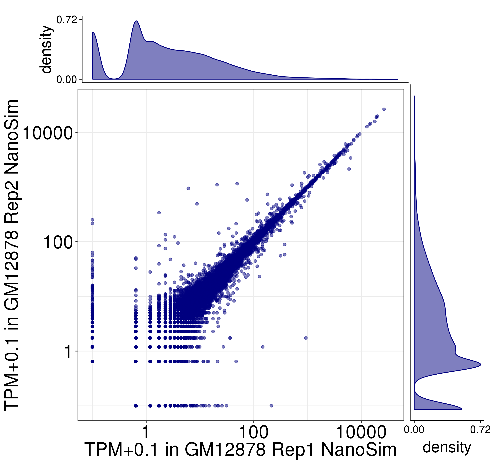
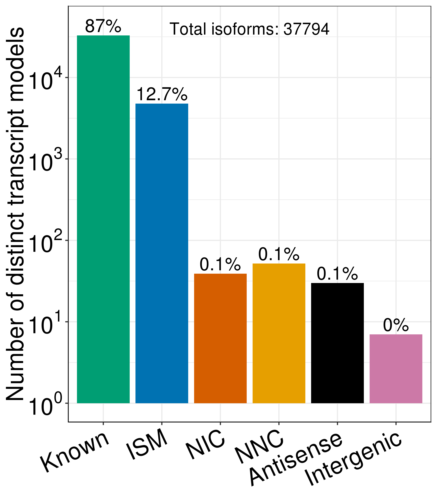
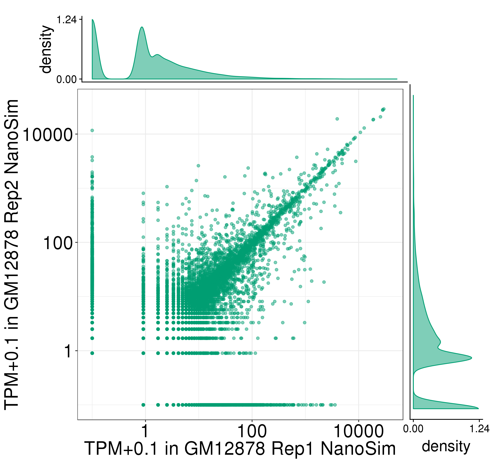
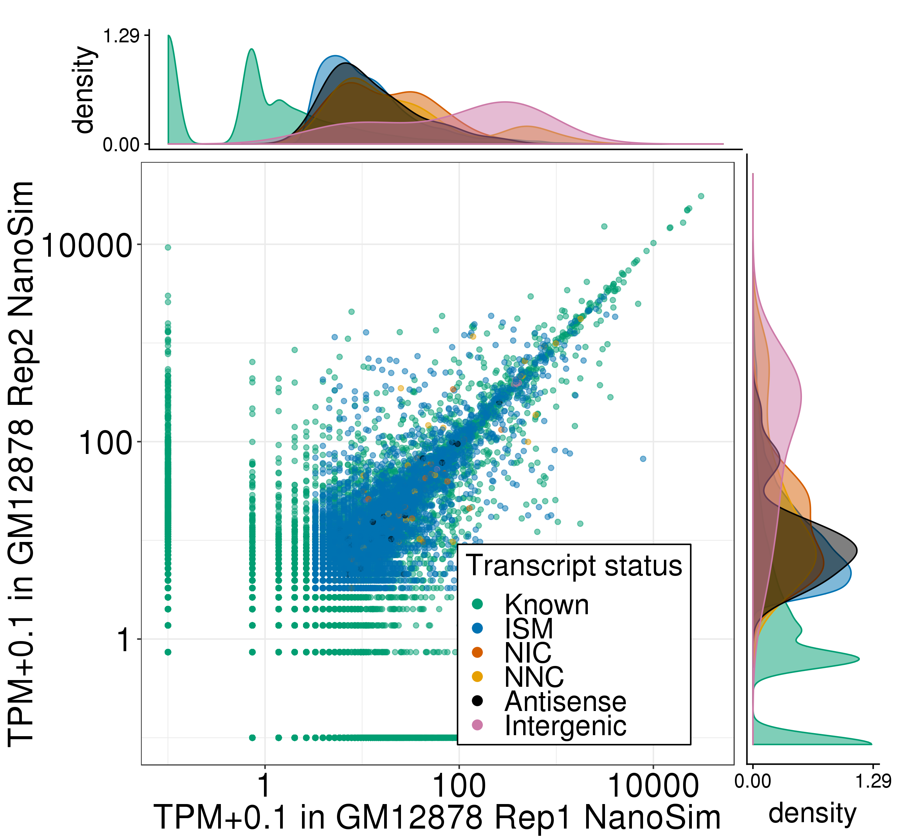
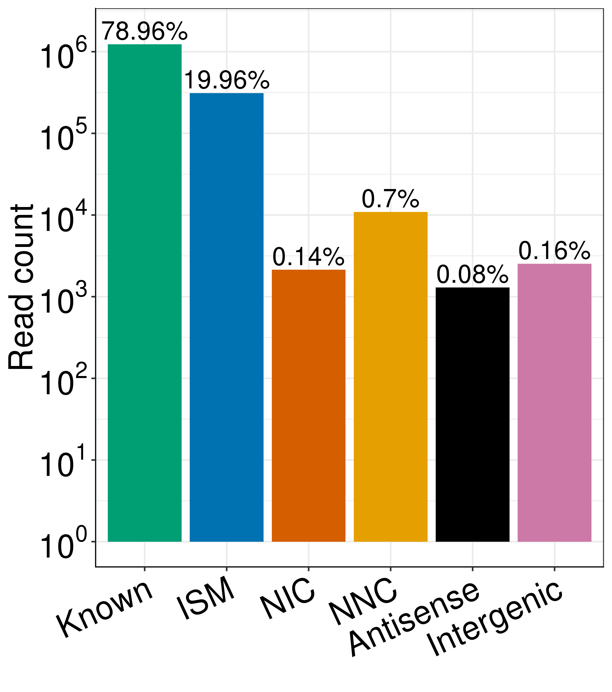
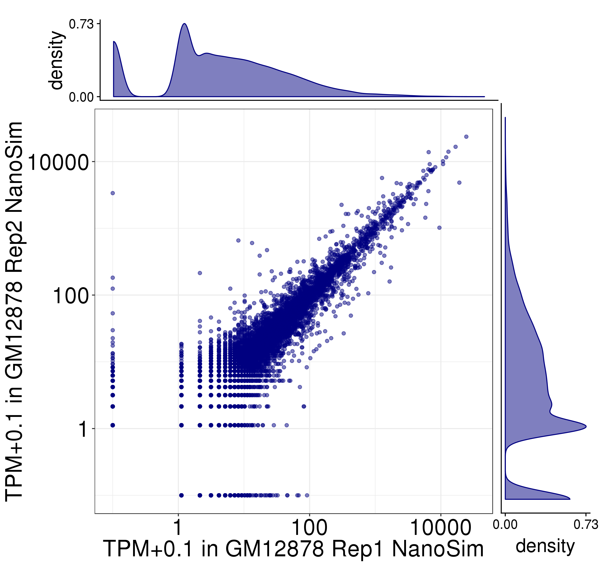
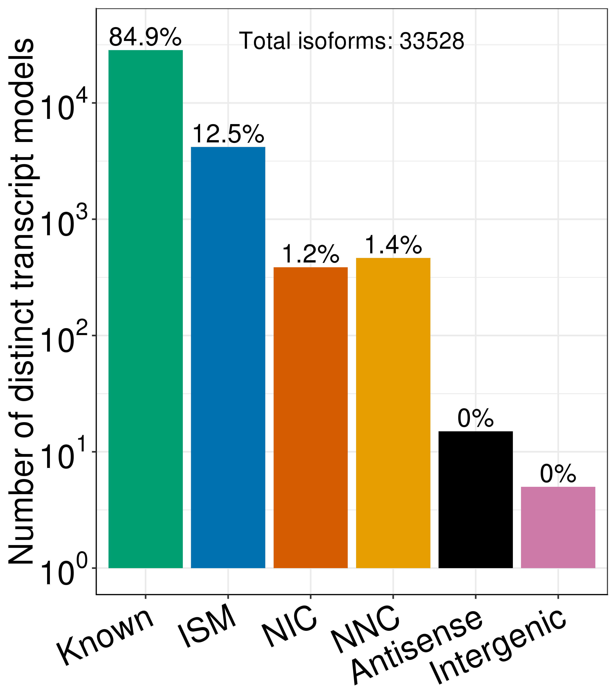
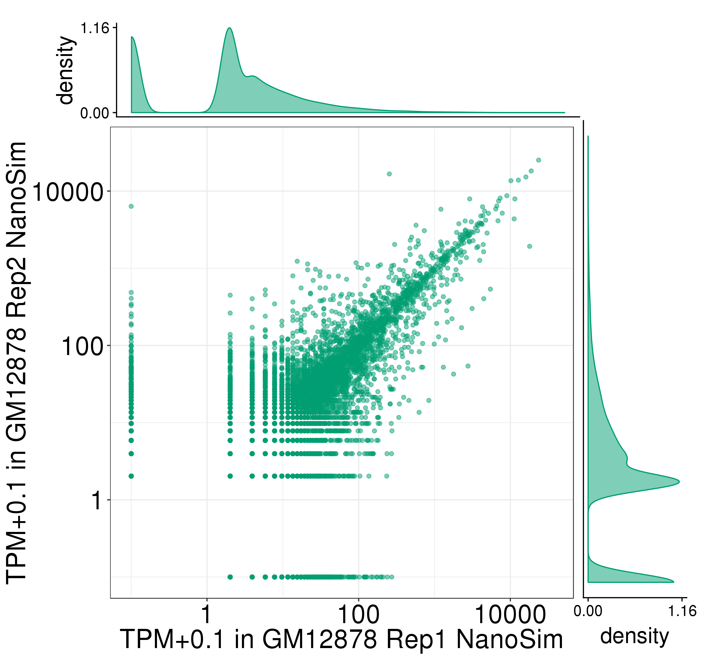
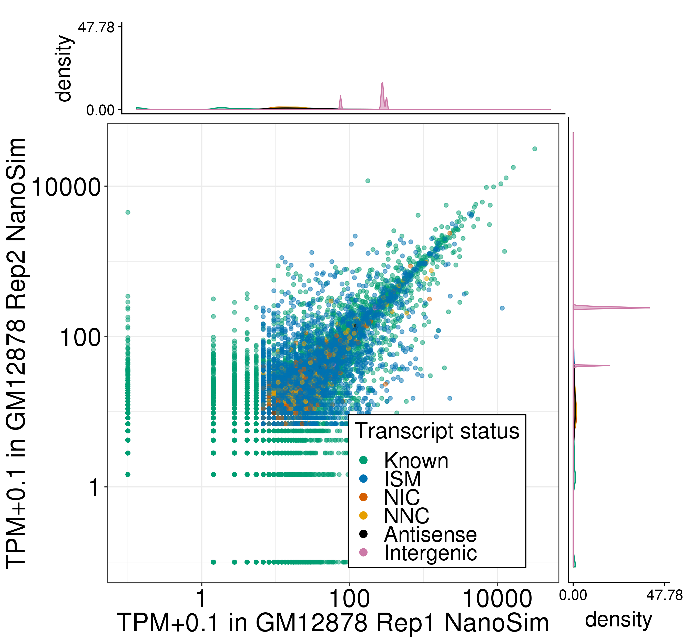
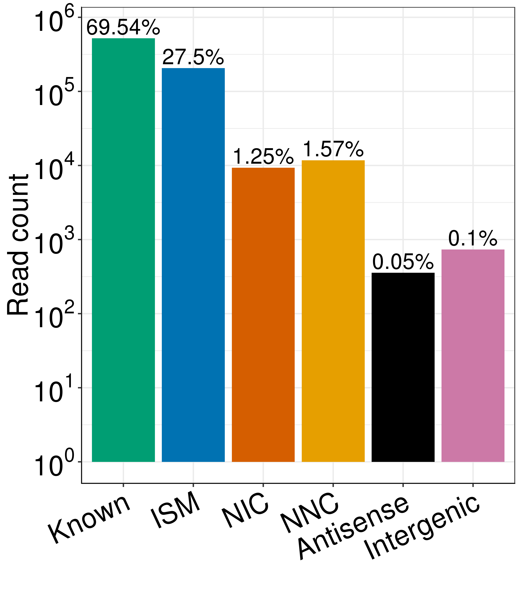

# ONT Simulated data

Step-by-step instructions on creating the figures used for the ONT simulations.

## Perfect simulated reads: reads with no indels or mismatches. Perfectly map to the transcriptome

```bash
PLOTPATH=../../plotting_scripts
ab=../talon/perf_talon_abundance.tsv
filt_ab=../talon/perf_talon_abundance_filtered.tsv
module load R/3.5.1
rep_1=rep1_perf
rep_2=rep2_perf
```

## Simulated replicate correlations
```bash
Rscript ${PLOTPATH}/plot_longread_gene_expression_corr.R \
          --f ${ab} \
          --color blue \
          --d1 $rep_1 \
          --d2 $rep_2 \
          --celltype GM12878 \
          --d1_type 'Rep1 NanoSim' \
          --d2_type 'Rep2 NanoSim' \
          --omitLegend \
          -o .
```


## Number of distinct transcript isoforms observed in each novelty category
```bash
Rscript ${PLOTPATH}/plot_novelty_categories_distinct_isoforms.R \
         --f ${filt_ab} \
         --datasets $rep_1,$rep_2 \
         --o .
```



## Expression level of known transcript models in each simulated replicate 
```bash
Rscript ${PLOTPATH}/plot_longread_transcript_expression_corr.R \
         --f ${filt_ab} \
         --d1 $rep_1 \
         --d1_type 'Rep1 NanoSim' \
         --d2 $rep_2 \
         --d2_type 'Rep2 NanoSim' \
         --celltype GM12878 \
         --omitLegend \
         -o .
```



## Expression level of transcript models in each simulated replicate, labelled by novelty assignment
```bash
Rscript ${PLOTPATH}/plot_longread_transcript_expression_corr.R \
         --f ${filt_ab} \
         --d1 $rep_1 \
         --d1_type 'Rep1 NanoSim' \
         --d2 $rep_2 \
         --d2_type 'Rep2 NanoSim' \
         --celltype GM12878 \
         --ISM --NIC --NNC --antisense --intergenic \
         -o .
```



## Total number of reads assigned to each novelty category (post filtering)
```bash
Rscript ${PLOTPATH}/plot_novelty_category_read_counts_one_dataset.R \
         --f ${filt_ab}  \
         --dataset $rep_1 \
         --o .
Rscript ${PLOTPATH}/plot_novelty_category_read_counts_one_dataset.R \
         --f ${filt_ab}  \
         --dataset $rep_2 \
         --o .
```



## Simulated reads: reads with indels and/or mismatches.

```bash
PLOTPATH=../../plotting_scripts
ab=../talon/talon_abundance.tsv
filt_ab=../talon/talon_abundance_filtered.tsv
module load R/3.5.1
rep_1=rep1
rep_2=rep2
```


## Simulated replicate correlations
```bash
Rscript ${PLOTPATH}/plot_longread_gene_expression_corr.R \
          --f ${ab} \
          --color blue \
          --d1 $rep_1 \
          --d2 $rep_2 \
          --celltype GM12878 \
          --d1_type 'Rep1 NanoSim' \
          --d2_type 'Rep2 NanoSim' \
          --omitLegend \
          -o .
```



## Number of distinct transcript isoforms observed in each novelty category
```bash
Rscript ${PLOTPATH}/plot_novelty_categories_distinct_isoforms.R \
         --f ${filt_ab} \
         --datasets $rep_1,$rep_2 \
         --o .
```



## Expression level of known transcript models in each simulated replicate 
```bash
Rscript ${PLOTPATH}/plot_longread_transcript_expression_corr.R \
         --f ${filt_ab} \
         --d1 $rep_1 \
         --d1_type 'Rep1 NanoSim' \
         --d2 $rep_2 \
         --d2_type 'Rep2 NanoSim' \
         --celltype GM12878 \
         --omitLegend \
         -o .
```



## Expression level of transcript models in each simulated replicate, labelled by novelty assignment
```bash
Rscript ${PLOTPATH}/plot_longread_transcript_expression_corr.R \
         --f ${filt_ab} \
         --d1 $rep_1 \
         --d1_type 'Rep1 NanoSim' \
         --d2 $rep_2 \
         --d2_type 'Rep2 NanoSim' \
         --celltype GM12878 \
         --ISM --NIC --NNC --antisense --intergenic \
         -o .
```



## Total number of reads assigned to each novelty category (post filtering)
```bash
Rscript ${PLOTPATH}/plot_novelty_category_read_counts_one_dataset.R \
         --f ${filt_ab}  \
         --dataset $rep_1 \
         --o .
Rscript ${PLOTPATH}/plot_novelty_category_read_counts_one_dataset.R \
         --f ${filt_ab}  \
         --dataset $rep_2 \
         --o .
```


