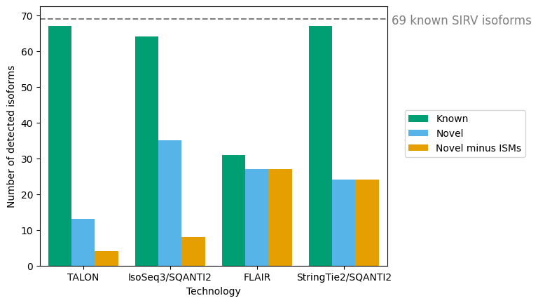

## SIRV analysis

We wanted to see how well TALON performed on detecting the 69 SIRV isoforms compared to other long-read annotators. A perfect tool would detect 69 known isoforms, representing the known SIRVs, and 0 novel isoforms, because each isoform is predetermined and well-characterized. 

```bash
python plot_sirv_detection.py
```

