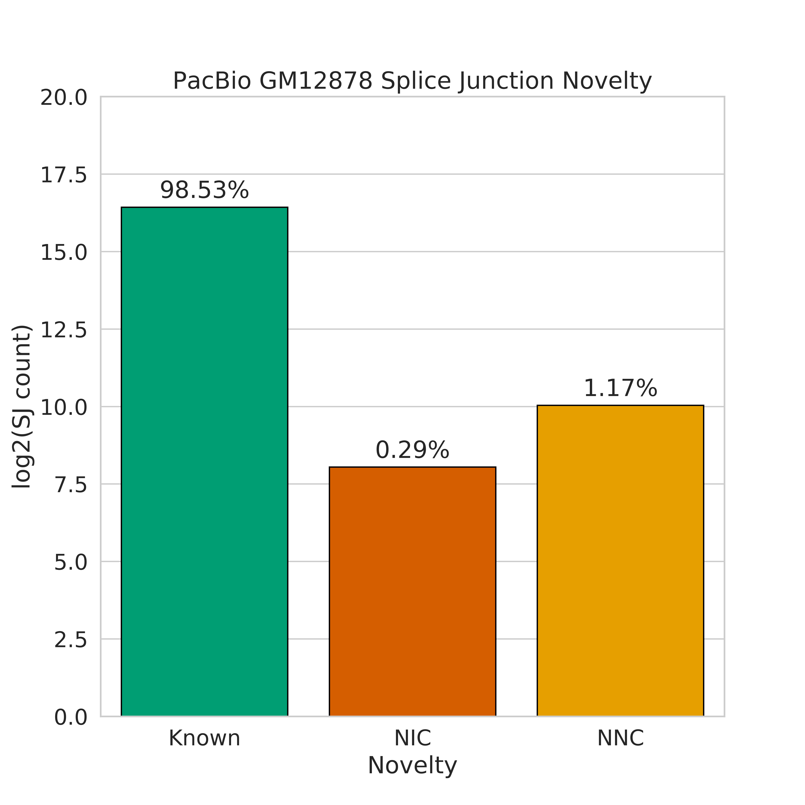
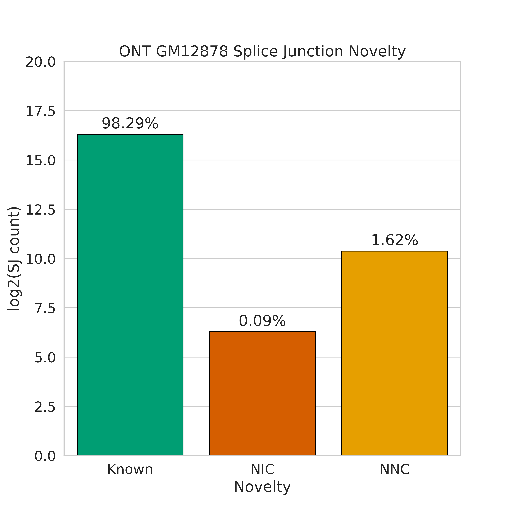
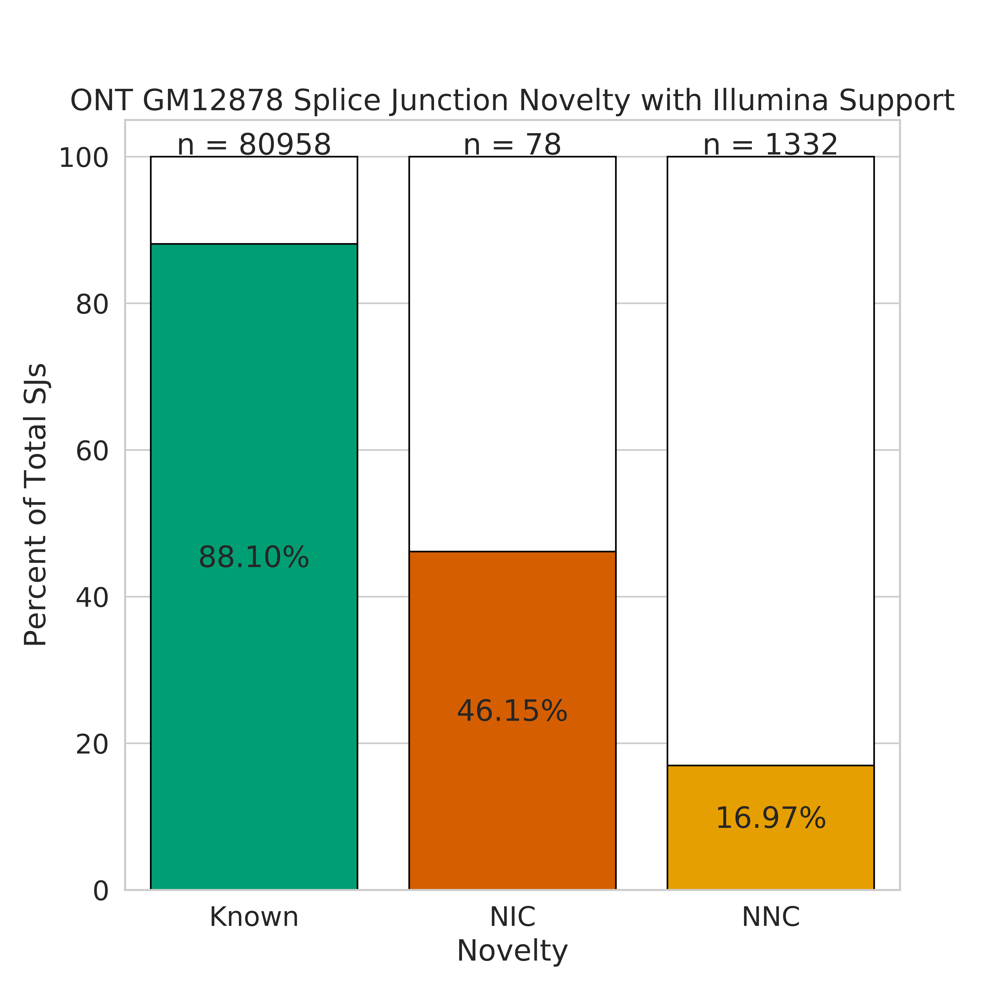
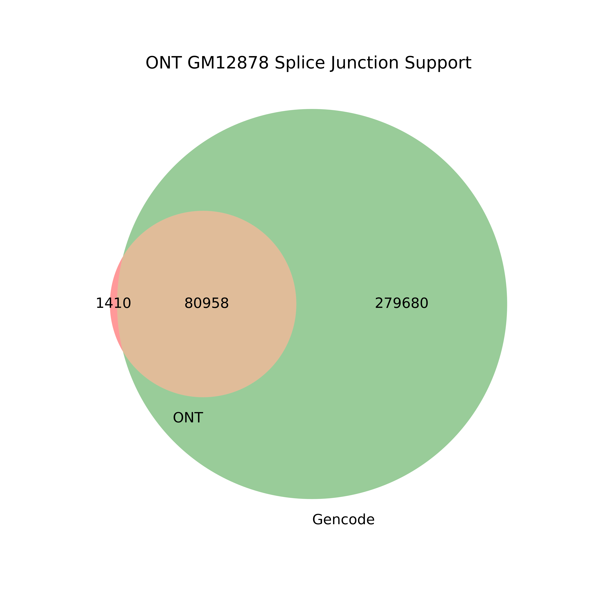
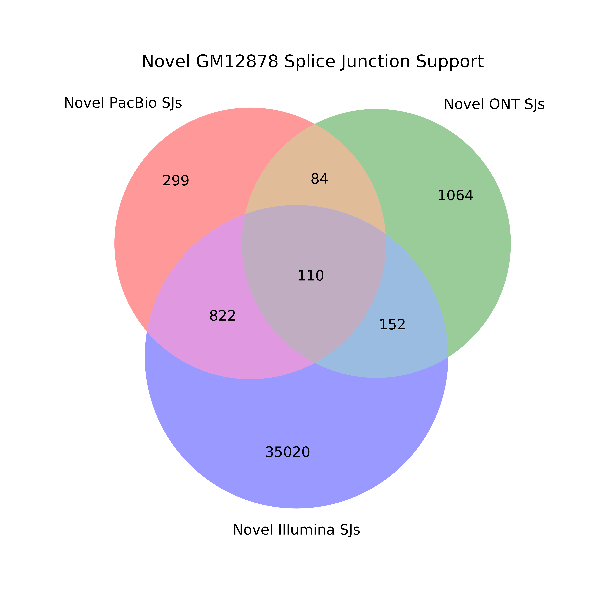
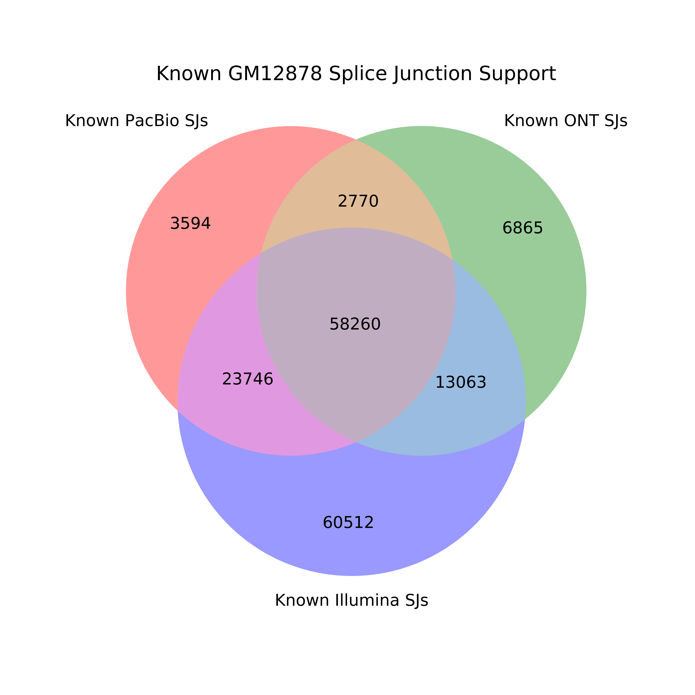

# Splicing Analysis

We did a lot of extra analysis of our data in terms of looking at splice junctions. The first step for running any of the sub-analyses in this directory is dependent on first obtaining the splice junctions from each dataset, which will be detailed here. 

We first want to investigate how the splice junctions in our data differ between PacBio, ONT, and Illumina.

1. Get the tables from the supplemental tables file that we'll be using, and set other paths that we'll be using (to the hg38 reference genome).
```bash
mkdir figures

# download the supplementary tables and change this path!
DATA=/share/crsp/lab/seyedam/share/TALON_paper_data/revisions_1-20/human_TALON/

gm_pb_gtf=${DATA}pb_talon.gtf
gm_ont_gtf=${DATA}ont_talon.gtf

REFPATH=~/mortazavi_lab/ref/hg38/
```

2. Extract splice junctions from GM12878 PacBio and ONT gtfs using TranscriptClean
```bash
python get_SJs_from_gtf.py \
	--f ${gm_pb_gtf} \
	--g ${REFPATH}hg38.fa \
	--o pb_talon_GM12878_sjs.tab

python get_SJs_from_gtf.py \
	--f ${gm_ont_gtf} \
	--g ${REFPATH}hg38.fa \
	--o ont_talon_GM12878_sjs.tab
```

3. Now, let's get the splice junctions present in the Illumina data by mapping with STAR. 
```bash
qsub run_STAR_illumina_GM12878_Rep1.sh
qsub run_STAR_illumina_GM12878_Rep2.sh
```

4. Filter out novel Illumina SJs that don't have support from both reps and known Illumina SJs that have no read support.
```bash
python filter_illumina_sjs.py \
	-sj_1 GM12878_Rep1_alignedSJ.out.tab \
	-sj_2 GM12878_Rep2_alignedSJ.out.tab 
```

5. Create a venn diagram demonstrating which splice junctions are present in which dataset.
```bash
python compare_sjs_venn.py \
	-pb pb_talon_GM12878_sjs.tab \
	-ont ont_talon_GM12878_sjs.tab \
	-illumina GM12878_alignedSJ.out.tab \
	-sample GM12878
```

 

 We wanted to investigate the support for and percent makeup for splice junctions of different novelty types. In this case we define splice junction novelty as the following: 

* **Known junction:** A splice junction with the whole splice junction (splice donor and acceptor) seen in the Gencode annotation
* **NIC junction:** A splice junction where both the splice donor and acceptor individually are in the Gencode annotation, but are never seen together
* **NNC junction:** A splice junction where at least one of the splice donor or acceptor is not present in the Gencode annotation

1. Going off of this, we first obtain the splice junction file from Gencode v29 using get_SJs_from_gtf.py utility.
```bash
ANNPATH=~/mortazavi_lab/ref/gencode.v29/
REFPATH=~/mortazavi_lab/ref/hg38/

python get_SJs_from_gtf.py \
    --f ${ANNPATH}gencode.v29.annotation.gtf \
	--g ${REFPATH}hg38.fa \
	--o gencode_v29_sjs.tab
```

2. We then use the splice junctions we extracted from the PacBio GM12878 gtf to label each splice junction with its novelty type
```bash
python label_sj_novelty.py \
	-sj pb_talon_GM12878_sjs.tab \
	-ref_sj gencode_v29_sjs.tab 
```

3. Now we can look at the proportions of known, nnc, and nic splice junctions present in our data in the form of a bar chart
```bash
python plot_sj_novelty_counts.py \
	-sj pb_talon_GM12878_sjs_novelty.tab \
	-sample "PacBio GM12878"
```



4. Get splice junction novelty types for our Illumina splice junction file so we can look for support for novel splice junctions in our short-read data
```bash
python label_sj_novelty.py \
	-sj GM12878_alignedSJ.out.tab \
	-ref_sj gencode_v29_sjs.tab 
```

5. Let's see what percentage of novel splice junctions are supported by Illumina data. 
```bash
python plot_sj_novelty_counts.py \
	-sj pb_talon_GM12878_sjs_novelty.tab \
	-sample "PacBio GM12878" \
	--extra_support GM12878_alignedSJ.out_novelty.tab \
	--support_name Illumina
```


6. Perform the same analyses for ont
```bash 
# get the novel ONT splice junctions
python label_sj_novelty.py \
	-sj ont_talon_GM12878_sjs.tab \
	-ref_sj gencode_v29_sjs.tab 

python plot_sj_novelty_counts.py \
	-sj ont_talon_GM12878_sjs_novelty.tab \
	-sample "ONT GM12878"

python plot_sj_novelty_counts.py \
	-sj ont_talon_GM12878_sjs_novelty.tab \
	-sample "ONT GM12878" \
	--extra_support GM12878_alignedSJ.out_novelty.tab \
	--support_name Illumina
```

 


7. We can also visualize how known and novel splice junctions are supported by the different technologies (illumina, pacbio, ont)
```bash
# get the novel PacBio splice junctions
python compare_sjs_venn2.py \
	-sj_1 pb_talon_GM12878_sjs_novelty.tab \
	-sj_1_name "PacBio" \
	-sj_2 gencode_v29_sjs.tab \
	-sj_2_name "Gencode" \
	-sample "PacBio GM12878"

# get the novel Illumina splice junctions
python compare_sjs_venn2.py \
 	-sj_1 GM12878_alignedSJ.out_novelty.tab \
	-sj_1_name "Illumina" \
	-sj_2 gencode_v29_sjs.tab \
	-sj_2_name "Gencode" \
	-sample "Illumina GM12878"

python compare_sjs_venn2.py \
	-sj_1 ont_talon_GM12878_sjs_novelty.tab \
	-sj_1_name "ONT" \
	-sj_2 gencode_v29_sjs.tab \
	-sj_2_name "Gencode" \
	-sample "ONT GM12878"

# compare novel splice junctions between 3 technologies
python compare_sjs_venn_new.py \
	-sj_1 PacBio_GM12878_unsupported_sjs.tab \
	-sj_1_name "Novel PacBio SJs" \
	-sj_3 Illumina_GM12878_unsupported_sjs.tab \
	-sj_3_name "Novel Illumina SJs" \
	-sj_2 ONT_GM12878_unsupported_sjs.tab  \
	-sj_2_name "Novel ONT SJs" \
	-sample "Novel GM12878" \
	--log

# compare known splice junctions between 3 technologies
python compare_sjs_venn_new.py \
	-sj_1 PacBio_GM12878_supported_sjs.tab \
	-sj_1_name "Known PacBio SJs" \
	-sj_3 Illumina_GM12878_supported_sjs.tab \
	-sj_3_name "Known Illumina SJs" \
	-sj_2 ONT_GM12878_supported_sjs.tab  \
	-sj_2_name "Known ONT SJs" \
	-sample "Known GM12878" \
	--log
```

  
