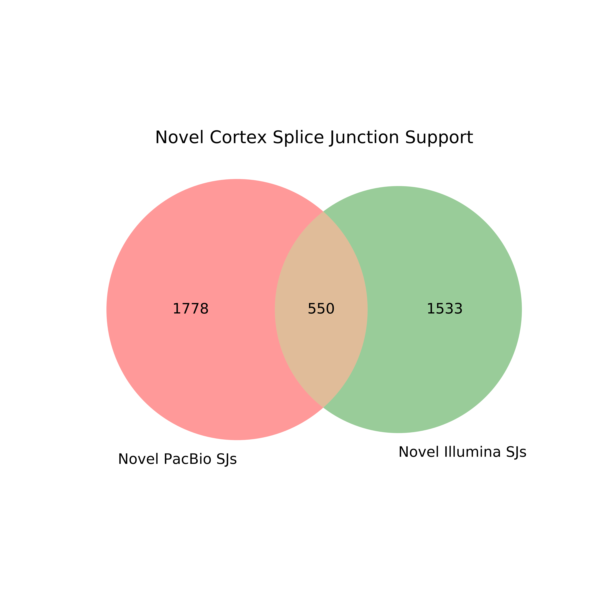

# Splicing Analysis

We did a lot of extra analysis of our data in terms of looking at splice junctions. The first step for running any of the sub-analyses in this directory is dependent on first obtaining the splice junctions from each dataset, which will be detailed here. 

We first want to investigate how the splice junctions in our data differ between PacBio, ONT, and Illumina.

1. Get the tables from the supplemental tables file that we'll be using, and set other paths that we'll be using (to the hg38 reference genome).
```bash
mkdir figures

# download the supplementary tables and change this path!
DATA=/share/crsp/lab/seyedam/share/TALON_paper_data/revisions_1-20/mouse_TALON/

cortex_pb_gtf=${DATA}Cortex_talon.gtf
hippo_pb_gtf=${DATA}Hippocampus_talon.gtf

REFPATH=/data/users/freese/mortazavi_lab/ref/mm10/
```

2. Extract splice junctions from cortex and hippocampus PacBio gtfs using TranscriptClean
```bash
python ../../get_SJs_from_gtf.py \
	--f ${cortex_pb_gtf} \
	--g ${REFPATH}mm10.fa \
	--o pb_talon_cortex_sjs.tab

python ../get_SJs_from_gtf.py \
	--f ${hippo_pb_gtf} \
	--g ${REFPATH}mm10.fa \
	--o pb_talon_hippo_sjs.tab
```

3. Now, let's get the splice junctions present in the Illumina data by mapping with STAR. 
```bash
qsub run_STAR_illumina_cortex_Rep1.sh
qsub run_STAR_illumina_cortex_Rep2.sh

qsub run_STAR_illumina_hippo_Rep1.sh
qsub run_STAR_illumina_hippo_Rep2.sh
```

4. Filter out novel Illumina SJs that don't have support from both reps and known Illumina SJs that have no read support.
```bash
python ../../filter_illumina_sjs.py \
	-sj_1 cortex_1_alignedSJ.out.tab \
	-sj_2 cortex_2_alignedSJ.out.tab

python ../../filter_illumina_sjs.py \
	-sj_1 hippo_1_alignedSJ.out.tab \
	-sj_2 hippo_2_alignedSJ.out.tab 
```

 We wanted to investigate the support for and percent makeup for splice junctions of different novelty types. In this case we define splice junction novelty as the following: 

* **Known junction:** A splice junction with the whole splice junction (splice donor and acceptor) seen in the Gencode annotation
* **NIC junction:** A splice junction where both the splice donor and acceptor individually are in the Gencode annotation, but are never seen together
* **NNC junction:** A splice junction where at least one of the splice donor or acceptor is not present in the Gencode annotation

1. Going off of this, we first obtain the splice junction file from Gencode vM21 using get_SJs_from_gtf.py utility.
```bash
ANNPATH=~/mortazavi_lab/ref/gencode.vM21/
REFPATH=~/mortazavi_lab/ref/mm10/

python ../../get_SJs_from_gtf.py \
    --f ${ANNPATH}gencode.vM21.annotation.gtf \
	--g ${REFPATH}mm10.fa \
	--o gencode_vM21_sjs.tab
```

2. We then use the splice junctions we extracted from the PacBio mouse brain gtfs to label each splice junction with its novelty type
```bash
python ../../label_sj_novelty.py \
	-sj pb_talon_cortex_sjs.tab \
	-ref_sj gencode_vM21_sjs.tab 

python ../../label_sj_novelty.py \
	-sj pb_talon_hippo_sjs.tab \
	-ref_sj gencode_vM21_sjs.tab 
```

3. Now we can look at the proportions of known, nnc, and nic splice junctions present in our data in the form of a bar chart
```bash
# TODO
python ../../plot_sj_novelty_counts.py \
	-sj pb_talon_cortex_sjs_novelty.tab \
	-sample "PacBio Cortex"

python ../../plot_sj_novelty_counts.py \
	-sj pb_talon_hippo_sjs_novelty.tab \
	-sample "PacBio Hippocampus"
```


4. Get splice junction novelty types for our Illumina splice junction files so we can look for support for novel splice junctions in our short-read data
```bash
python ../../label_sj_novelty.py \
	-sj cortex_alignedSJ.out.tab \
	-ref_sj gencode_vM21_sjs.tab 

python ../label_sj_novelty.py \
	-sj hippo_alignedSJ.out.tab \
	-ref_sj gencode_vM21_sjs.tab 
```

5. Let's see what percentage of novel splice junctions are supported by Illumina data. 
```bash
python ../../plot_sj_novelty_counts.py \
	-sj pb_talon_cortex_sjs_novelty.tab \
	-sample "PacBio Cortex" \
	--extra_support cortex_alignedSJ.out_novelty.tab \
	--support_name Illumina

python ../../plot_sj_novelty_counts.py \
	-sj pb_talon_hippo_sjs_novelty.tab \
	-sample "PacBio Hippocampus" \
	--extra_support hippo_alignedSJ.out_novelty.tab \
	--support_name Illumina
```


7. We can also visualize how known and novel splice junctions are supported by the different technologies (illumina, pacbio)
```bash
# get the novel PacBio splice junctions
python ../../compare_sjs_venn2.py \
	-sj_1 pb_talon_cortex_sjs_novelty.tab \
	-sj_1_name "PacBio" \
	-sj_2 gencode_vM21_sjs.tab \
	-sj_2_name "Gencode" \
	-sample "PacBio Cortex"

# get the novel Illumina splice junctions
python ../../compare_sjs_venn2.py \
 	-sj_1 cortex_alignedSJ.out_novelty.tab \
	-sj_1_name "Illumina" \
	-sj_2 gencode_vM21_sjs.tab \
	-sj_2_name "Gencode" \
	-sample "Illumina Cortex"

# look at novel/known splice junction support by Illumina data
python ../../compare_sjs_venn2.py \
	-sj_1 PacBio_Cortex_unsupported_sjs.tab \
	-sj_1_name "Novel PacBio SJs" \
	-sj_2 Illumina_Cortex_unsupported_sjs.tab \
	-sj_2_name "Novel Illumina SJs" \
	-sample "Novel Cortex"

python ../../compare_sjs_venn2.py \
	-sj_1 PacBio_Cortex_supported_sjs.tab \
	-sj_1_name "Known PacBio SJs" \
	-sj_2 Illumina_Cortex_supported_sjs.tab \
	-sj_2_name "Known Illumina SJs" \
	-sample "Known Cortex"


# do the same in hippocampus
python ../../compare_sjs_venn2.py \
	-sj_1 pb_talon_hippo_sjs_novelty.tab \
	-sj_1_name "PacBio" \
	-sj_2 gencode_vM21_sjs.tab \
	-sj_2_name "Gencode" \
	-sample "PacBio Hippocampus"

python ../../compare_sjs_venn2.py \
 	-sj_1 hippo_alignedSJ.out_novelty.tab \
	-sj_1_name "Illumina" \
	-sj_2 gencode_vM21_sjs.tab \
	-sj_2_name "Gencode" \
	-sample "Illumina Hippocampus"

python ../../compare_sjs_venn2.py \
	-sj_1 PacBio_Hippocampus_unsupported_sjs.tab \
	-sj_1_name "Novel PacBio SJs" \
	-sj_2 Illumina_Hippocampus_unsupported_sjs.tab \
	-sj_2_name "Novel Illumina SJs" \
	-sample "Novel Hippocampus"

python ../../compare_sjs_venn2.py \
	-sj_1 PacBio_Hippocampus_supported_sjs.tab \
	-sj_1_name "Known PacBio SJs" \
	-sj_2 Illumina_Hippocampus_supported_sjs.tab \
	-sj_2_name "Known Illumina SJs" \
	-sample "Known Hippocampus"
```




## Illumina/Gencode splice junction support for whole transcripts

We want to determine what the percentage of PacBio TALON transcripts with all of their splice junctions supported by short-read data is. We decided to subset on novelty to provide some more insight. We'll show this step-by-step example for GM12878 first.

1. Use the mouse brain PacBio GTF and Illumina SJs to see how many transcripts of each category have all of their splice junctions supported by Illumina data.
```bash
python ../get_isoform_sj_support.py \
	-gtf ${cortex_pb_gtf} \
	-ref_sj_1 cortex_alignedSJ.out.tab \
	-ref_sj_2 gencode_vM21_sjs.tab \
	-sample pb_cortex
```

2. Generate a summary table counting how many transcripts in each novelty category are supported by GENCODE or Illumina
```bash
# TODO
python ../gen_isoform_support_table.py \
	-csv pb_cortex_isoform_sj_support.csv \
	-sample pb_cortex
```

3. Visualize Illumina support vs. isoform novelty type. Keep in mind that a transcript towards having Illumina support must have ALL of its splice junctions supported by the Illumina data.
```bash
# TODO
python ../plot_isoform_sj_support_by_novelty.py \
	-c pb_cortex_isoform_sj_support_summary.csv \
	-s "PacBio Cortex"
```


4. Also run this on the hippocampus data
```bash
python ../get_isoform_sj_support.py \
	-gtf ${hippo_pb_gtf} \
	-ref_sj_1 hippo_alignedSJ.out.tab \
	-ref_sj_2 gencode_vM21_sjs.tab \
	-sample pb_hippo

# TODO
python ../gen_isoform_support_table.py \
	-csv pb_hippo_isoform_sj_support.csv \
	-sample pb_hippo
# TODO
python ../plot_isoform_sj_support_by_novelty.py \
	-c pb_hippo_isoform_sj_support_summary.csv \
	-s "PacBio Hippocampus"
```


